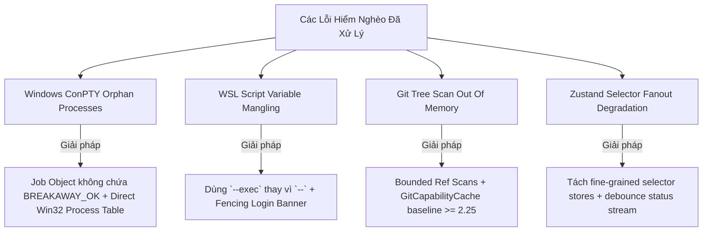

# Bộ Nhớ Dự Án, Quy Tắc Bất Biến & Cẩm Nang Nhân Bản Phần Mềm (MEMORY.md)

Tài liệu này đóng vai trò là **Bộ Nhớ Dài Hạn (Persistent Long-term Memory)** của dự án **Orca**. Nó lưu giữ các quyết định kiến trúc bất biến, lịch sử đúc kết kinh nghiệm qua các phiên làm việc, danh mục các lỗi hiểm nghèo cần tránh (Pitfalls), và cẩm nang hướng dẫn mở rộng tính năng cũng như nhân bản (clone/replicate) toàn bộ phần mềm.

---

## 1. Các Nguyên Tắc & Quy Tắc Bất Biến (Architectural Invariants)

Bất kỳ AI Agent hay Lập trình viên nào khi chỉnh sửa hoặc phát triển thêm tính năng cho Orca **BẮT BUỘC** phải tuân thủ nghiêm ngặt các bất biến sau:

### 1.1. An Toàn Không Gian Làm Việc (Worktree & Path Safety)
- **Worktree Boundary**: Mọi thao tác đọc, viết mã, chạy lệnh của agent phải luôn thực hiện trong không gian thư mục làm việc chính (`current worktree`). Tuyệt đối không nhảy ra đường dẫn tuyệt đối của repo gốc khi đang chạy trong nhánh con.
- **Cross-Platform Paths**: Luôn sử dụng `path.join`, `path.resolve` hoặc tiện ích chuẩn của Node/Electron — không bao giờ hardcode dấu gạch chéo `/` hoặc `\`.

### 1.2. An Toàn Thực Thi Tiến Trình Trên Windows (Windows Child Processes & EDR)
- **Cấm gọi trực tiếp `child_process.spawn`**: Bắt buộc phải thông qua `runProcess`/`spawnProcess` trong [`src/shared/child-process/`](file:///d:/code/orca/src/shared/child-process).
- **Cấm `shell: true` & Luôn ghim `windowsHide: true`**: Tránh việc bung cửa sổ dòng lệnh đen làm mất focus của người dùng và tránh bị hệ thống EDR / Antivirus gắn cờ độc hại.
- **Phân giải Shim `.cmd`/`.bat`**: Luôn giải quyết shim npm/pnpm về file `.js` / executable đích để tránh triệu gọi trung gian qua `cmd.exe /c` (MSYS/Git Bash có thể viết lại tham số `/c`).
- **MSYS / ConPTY Job Breakaway**: Job Object của PTY trên Windows phải được khởi tạo **không có cờ `JOB_OBJECT_LIMIT_BREAKAWAY_OK`** để đảm bảo không một tiến trình con nào bị rò rỉ khi IDE đóng lại.

### 1.3. Ranh Giới Thực Thi Từ Xa & Máy Chủ SSH (SSH & WSL Execution Boundary)
- **Chủ quyền máy chủ (Execution Host Sovereignty)**: Host từ xa sở hữu toàn bộ vòng đời tiến trình. Mất kết nối mạng **KHÔNG PHẢI** là bằng chứng tiến trình đã chết.
- **Từ vựng phán quyết bắt buộc**: Chỉ sử dụng đúng 3 từ khóa phán quyết: `live` (còn sống), `unverifiable` (không thể xác minh do mất mạng), `exited` (đã thoát). Tuyệt đối không dùng từ đồng nghĩa khác.
- **WSL Commands**: Bắt buộc dùng `buildWslExecArgs` với cờ `--exec` (không dùng cờ `--` vì `wsl.exe` sẽ tự động expand biến `$name` gây hỏng kịch bản script).

### 1.4. Tương Thích Ngược Bản Giao Tiếp Từ Xa (Remote Wire Compatibility)
- **Mixed Version Invariant**: Máy khách (Client/Mobile) và Máy chủ (Remote Host) cập nhật độc lập, do đó trạng thái phiên bản hỗn hợp là bình thường.
- Trường mới trong schema phải luôn là **Optional** (`.optional()`).
- Bổ sung Opcode luồng dữ liệu mới bắt buộc phải trải qua bước đàm phán năng lực (Capability Negotiation) ở bước bắt tay (Handshake).

### 1.5. Thiết Kế Giao Diện & UI System (Design System Rules)
- Mọi UI phải tuân thủ tokens tại `src/renderer/src/assets/main.css` và primitives tại `src/renderer/src/components/ui/`.
- Không tự ý thêm mã màu tùy biến hoặc kích thước font ngoài hệ thống design system.
- Không bao giờ thêm comment thừa giải thích code hiển nhiên; chỉ thêm comment ngắn gọn (1 dòng) giải thích lý do thiết kế (WHY, not HOW).

---

## 2. Lịch Sử Đúc Kết Kinh Nghiệm & Phòng Tránh Lỗi (Lessons Learned & Pitfalls)



1. **Sự cố Git Tree Scan Out of Memory**: Trước đây việc duyệt toàn bộ refs bằng `git ls-tree -r` khiến repository lớn tiêu tốn hàng Gigabyte RAM. Giải pháp: Áp dụng thuật toán quét cây thư mục có giới hạn (`bounded tree scan`) với `--max-count` và cache trạng thái năng lực git.
2. **Sự cố Antivirus EDR trên Windows gắn cờ cảnh báo**: Việc chạy các script powershell với cờ `-ExecutionPolicy Bypass` hoặc `-EncodedCommand` bị các phần mềm bảo mật doanh nghiệp (CrowdStrike, Windows Defender ATP) chặn. Giải pháp: Chuyển toàn bộ tác vụ sang binary native biên dịch sẵn hoặc thực thi qua Node.js child runner an toàn.
3. **Sự cố Lag Giật Render khi Agent Stream dữ liệu lớn**: Khi 5 agent cùng stream log terminal tốc độ cao, giao diện React bị giật do re-render toàn bộ cây component. Giải pháp: Tách nhỏ Zustand stores, áp dụng memoized selectors và dồn luồng ký tự (batching text buffer) trước khi vẽ lên WebGL canvas.

---

## 3. Cẩm Nang Mở Rộng Tính Năng Mới (Feature Extension Playbook)

### 3.1. Hướng Dẫn Tích Hợp Thêm Một AI Agent CLI Mới
Khi muốn tích hợp một Agent CLI mới (ví dụ: `my-ai-engine`):
1. **Khai báo Launch Profile**: Tạo file cấu hình tại [`src/main/agent-launch/`](file:///d:/code/orca/src/main/agent-launch) định nghĩa đường dẫn thực thi, cờ tham số, biến môi trường và proxy.
2. **Tích hợp Hook Telemetry**: Cấu hình webhook URL chuyển hướng về local hook server để nhận thông báo trạng thái.
3. **Đăng ký UI Provider**: Bổ sung icon, màu đại diện và cấu hình gợi ý lệnh vào [`src/renderer/src/components/agent-status/`](file:///d:/code/orca/src/renderer/src/components/agent-status).
4. **Kiểm thử Transcript Capture**: Ghi lại transcript thực tế của Agent qua `pnpm run capture:agent-transcript` để đảm bảo parser nhận diện chính xác các trạng thái blocked/ready/thinking.

### 3.2. Hướng Dẫn Tích Hợp Một Source Control Provider Mới (vd: Forgejo / Gitea)
1. Cài đặt Interface Client tại [`src/main/providers/`](file:///d:/code/orca/src/main/providers).
2. Xây dựng adapter chuẩn hóa API PRs, Issues, Comments về schema chung của Orca.
3. Đăng ký IPC channels trong [`src/main/ipc/`](file:///d:/code/orca/src/main/ipc).
4. Bổ sung giao diện duyệt trong `src/renderer/src/components/review/`.

---

## 4. Cẩm Nang Nhân Bản & Tái Cấu Trúc Đóng Gói (Replication & White-labeling Guide)

Để nhân bản hoặc phát triển một sản phẩm IDE phái sinh từ Orca cho doanh nghiệp/tổ chức riêng:

### 4.1. Phân Tách Lớp Lõi (Core Isolation)
- **Engine Tách Rời**: Toàn bộ logic quản lý Worktree, PTY Daemon, Hook Server nằm tại `src/main/` và `src/shared/` hoàn toàn độc lập với giao diện hiển thị.
- **Giao diện Client**: Giao diện React trong `src/renderer/` có thể thay thế theme, logo, token màu sắc tại `src/renderer/src/assets/main.css`.

### 4.2. Cấu Hình Tên Ứng Dụng & Bundle Identifiers
1. Chỉnh sửa `package.json` (`name`, `version`, `appId`, `productName`).
2. Cập nhật icon và asset tại `resources/build/`.
3. Cấu hình file build `electron.vite.config.ts` và script đóng gói `config/scripts/`.

### 4.3. Pipeline Xây Dựng & Đóng Gói (Build & Distribution Pipeline)

```bash
# 1. Cài đặt toàn bộ dependencies cho các kiến trúc CPU (x64, arm64)
pnpm run install:release

# 2. Kiểm tra chất lượng mã nguồn & Design System
pnpm tc
pnpm run check:code-quality:changed

# 3. Build toàn bộ các phân hệ (Relay, CLI, Electron Main/Renderer, Mobile Web)
pnpm run build:desktop

# 4. Đóng gói bộ cài đặt theo từng nền tảng
# - Windows: NSIS Installer (.exe) / Portable
# - macOS: DMG / PKG (hỗ trợ cả Apple Silicon arm64 và Intel x64)
# - Linux: AppImage / Deb
pnpm run build
```
