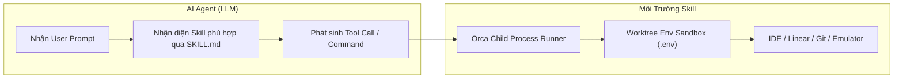

# Hệ Sinh Thái Kỹ Năng & Hướng Dẫn Tích Hợp Kỹ Năng (SKILLS.md)

Tài liệu này tổng hợp toàn bộ danh mục **Agent Skills** (kỹ năng công cụ) tích hợp sẵn trong Orca, cơ chế vận hành, chuẩn định dạng và cẩm nang xây dựng/tích hợp thêm các kỹ năng mới cho các hệ thống AI Agent (Claude Code, Antigravity, OpenCode, Codex, Pi...).

---

## 1. Tổng Quan Về Agent Skills Trong Orca

Trong Orca, **Skill** là một gói chỉ dẫn (instruction set) và công cụ chuyên biệt hóa giúp AI Agent có khả năng tương tác với hệ điều hành, IDE, thiết bị giả lập, hệ thống quản lý tác vụ (Linear/GitHub), và phân tán luồng công việc đa luồng.

Mỗi skill bao gồm:
- **`SKILL.md`**: Tệp tài liệu cốt lõi chứa metadata YAML frontmatter (`name`, `description`), hướng dẫn thực thi, nguyên tắc an toàn và ví dụ mẫu.
- **Scripts / CLI Helpers** *(tuỳ chọn)*: Các tiện ích dòng lệnh được triệu gọi an toàn trong môi trường sandbox của agent.

---

## 2. Thống Kê Chi Tiết Danh Mục Skills Tích Hợp Sẵn

Dưới đây là bảng thống kê các kỹ năng gốc nằm trong thư mục [`skills/`](file:///d:/code/orca/skills):

| Tên Kỹ Năng (Skill Name) | Đường dẫn | Mục Đích & Khả Năng Thực Thi | Khi Nào Sử Dụng |
| :--- | :--- | :--- | :--- |
| **`orchestration`** | [`skills/orchestration/SKILL.md`](file:///d:/code/orca/skills/orchestration/SKILL.md) | Phân phối tác vụ song song đa worktree (Fan-out execution), tổng hợp và đánh giá kết quả từ nhiều agent để chọn giải pháp tối ưu (Merge Winner). | Khi cần giải quyết một bài toán phức tạp bằng cách thử nghiệm nhiều cách tiếp cận cùng lúc trên các nhánh Git độc lập. |
| **`orca-cli`** | [`skills/orca-cli/SKILL.md`](file:///d:/code/orca/skills/orca-cli/SKILL.md) | Giao tiếp tự động với Orca IDE thông qua command line (`orca workspace`, `orca agent`, `orca status`, `orca review`). | Khi agent cần chủ động tạo workspace mới, kích hoạt agent phụ (subagent), hoặc đọc ngữ cảnh từ IDE. |
| **`orca-linear`** / **`linear-tickets`** | [`skills/orca-linear/SKILL.md`](file:///d:/code/orca/skills/orca-linear/SKILL.md), [`skills/linear-tickets/SKILL.md`](file:///d:/code/orca/skills/linear-tickets/SKILL.md) | Truy vấn, tạo mới, cập nhật trạng thái ticket trên Linear, tự động liên kết issue ID với Git branch và worktree. | Khi luồng công việc yêu cầu nhận task trực tiếp từ Linear board hoặc đồng bộ tiến độ sau khi hoàn thành code. |
| **`orca-per-workspace-env`** | [`skills/orca-per-workspace-env/SKILL.md`](file:///d:/code/orca/skills/orca-per-workspace-env/SKILL.md) | Quản lý biến môi trường (`.env`, secret tokens, port mappings) được cô lập riêng biệt cho từng Git worktree. | Tránh xung đột port máy chủ dev (vd: 3000, 3001...) hoặc biến môi trường database giữa các agent chạy đồng thời. |
| **`orca-emulator`** / **`orca-emulator-android`** | [`skills/orca-emulator/SKILL.md`](file:///d:/code/orca/skills/orca-emulator/SKILL.md), [`skills/orca-emulator-android/SKILL.md`](file:///d:/code/orca/skills/orca-emulator-android/SKILL.md) | Khởi động, điều khiển, chụp màn hình và kiểm thử ứng dụng di động trên Android Emulator / iOS Simulator. | Dùng trong quy trình phát triển và kiểm thử giao diện ứng dụng Flutter di động (`mobile/`). |
| **`computer-use`** | [`skills/computer-use/SKILL.md`](file:///d:/code/orca/skills/computer-use/SKILL.md) | Điều khiển chuột, bàn phím, tương tác màn hình native để thực thi các thao tác UI phức tạp ngoài terminal. | Khi cần tự động hoá kiểm thử E2E giao diện desktop mà không có API lập trình trực tiếp. |

---

## 3. Quy Trình Khởi Chạy & Tương Tác Giữa Agent và Skills



---

## 4. Hướng Dẫn Tạo & Đóng Gói Kỹ Năng Mới (Skill Creation Playbook)

Để bổ sung một Skill mới vào hệ sinh thái Orca, tuân thủ các bước chuẩn mực sau:

### Bước 1: Tạo thư mục skill
Tạo một thư mục mới trong `skills/<tên-kỹ-năng>/` (Tên dạng kebab-case, thể hiện đúng domain chức năng):
```
skills/
└── my-custom-tool/
    ├── SKILL.md
    └── scripts/ (tuỳ chọn)
```

### Bước 2: Viết tệp `SKILL.md` theo chuẩn định dạng
Tệp `SKILL.md` bắt buộc phải có phần Frontmatter YAML ở đầu tệp:

```markdown
---
name: my-custom-tool
description: Mô tả ngắn gọn (1-2 câu) về chức năng và điều kiện kích hoạt kỹ năng này.
---

# Tên Kỹ Năng

## Mục Đích
Mô tả rõ ràng kỹ năng này giải quyết vấn đề gì.

## Hướng Dẫn Sử Dụng
Chi tiết các bước thực hiện, cú pháp lệnh hoặc API mà agent cần triệu gọi.

## Quy Tắc An Toàn (Safety Rules)
- Không chạy các lệnh phá hủy dữ liệu.
- Phải xác thực môi trường trước khi thực thi.

## Ví Dụ Thực Tế
```bash
orca my-custom-tool --action run --param value
```
```

### Bước 3: Đăng ký và đồng bộ Catalog
Sau khi thêm skill mới, chạy lệnh tự động kiểm tra và build catalog:
```bash
# Tạo và cập nhật bundle manifest cho skills
pnpm run generate:bundled-skill-guides
pnpm run generate:skill-bundle-manifest

# Kiểm tra tính toàn vẹn của skills
pnpm run verify:bundled-skill-guides
pnpm run verify:skill-bundle-manifest
```
