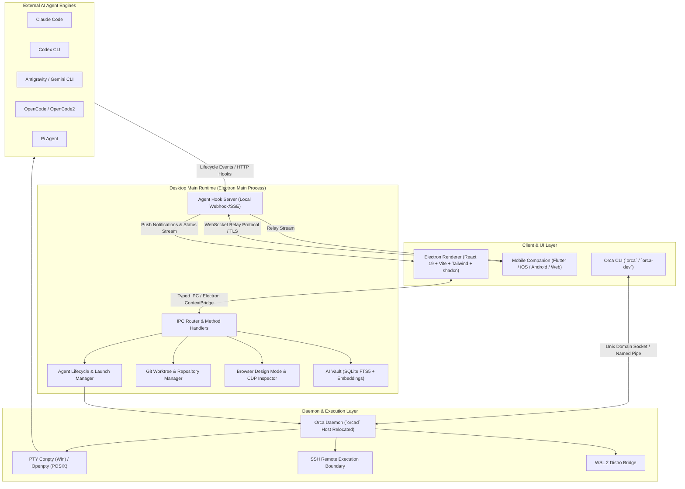
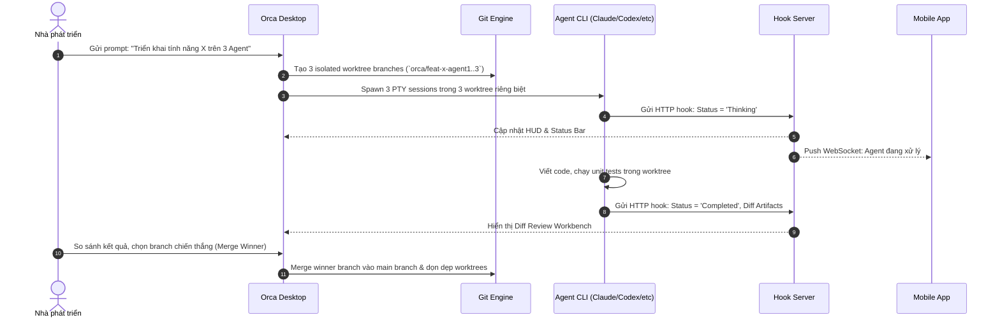

# Kiến Trúc Kỹ Thuật Toàn Diện & Thuật Toán Hệ Thống Orca (TECH.md)

Tài liệu này cung cấp cái nhìn chi tiết về kiến trúc kỹ thuật, danh mục module, các thuật toán cốt lõi, giao thức truyền thông và cơ chế thực thi của **Orca** — AI Orchestrator đa nền tảng cho việc phát triển phần mềm song song bằng nhiều AI Agent.

---

## 1. Tổng Quan Kiến Trúc (System Architecture)

Orca được xây dựng theo kiến trúc đa tầng (Multi-tier Architecture) với mô hình đa tiến trình (Multi-process), kết hợp giữa **Electron Desktop**, **Background Daemon (`orcad`)**, **Relay Server**, **CLI toolchain**, và **Mobile Companion App (Flutter)**.

---

## 2. Thống Kê & Phân Tích Danh Mục Các Module

### 2.1. Module Main Process (`src/main/`)

| Phân hệ (Subsystem) | Đường dẫn | Chức năng & Trách nhiệm |
| :--- | :--- | :--- |
| **Agent Hooks** | [`src/main/agent-hooks/`](file:///d:/code/orca/src/main/agent-hooks) | Webhook server cục bộ tiếp nhận telemetry, status, tool calls từ các Agent CLI thông qua HTTP POST / SSE. |
| **Agent Launch** | [`src/main/agent-launch/`](file:///d:/code/orca/src/main/agent-launch) | Khởi chạy các Agent CLI trong môi trường cô lập, inject shell env, per-worktree context và proxy. |
| **AI Vault & Search** | [`src/main/ai-vault/`](file:///d:/code/orca/src/main/ai-vault), [`src/main/ai-vault-search/`](file:///d:/code/orca/src/main/ai-vault-search) | Lưu trữ cơ sở tri thức cục bộ, index lịch sử chat/session bằng SQLite FTS5 và Vector embeddings. |
| **Artifacts** | [`src/main/artifacts/`](file:///d:/code/orca/src/main/artifacts) | Quản lý vòng đời artifact (code diff, plan, summary, visual mockups) được agent xuất bản. |
| **Browser & Design Mode** | [`src/main/browser/`](file:///d:/code/orca/src/main/browser) | Điều khiển Chromium WebContents, CDP (Chrome DevTools Protocol) để bóc tách DOM, CSS styles và chụp screenshot toạ độ. |
| **Daemon (`orcad`)** | [`src/main/daemon/`](file:///d:/code/orca/src/main/daemon), [`src/main/orcad/`](file:///d:/code/orca/src/main/orcad) | Quản lý tiến trình nền độc lập (`orcad`), duy trì kết nối PTY và phiên làm việc khi GUI khởi động lại. |
| **Git & Worktrees** | [`src/main/git/`](file:///d:/code/orca/src/main/git) | Tạo lập, dọn dẹp, đồng bộ hoá Git Worktrees song song, đảm bảo tương thích từ Git 2.25 trở lên. |
| **Ghostty & PTY** | [`src/main/ghostty/`](file:///d:/code/orca/src/main/ghostty), [`src/main/pty/`](file:///d:/code/orca/src/main/pty) | Giao tiếp low-level với ConPTY (Windows) và POSIX PTY (macOS/Linux), WebGL rendering pipelines. |
| **IPC Router** | [`src/main/ipc/`](file:///d:/code/orca/src/main/ipc) | Typed IPC router kết nối an toàn giữa Main Process và Renderer thông qua schema Zod. |
| **Remote (SSH/WSL)** | [`src/main/ssh/`](file:///d:/code/orca/src/main/ssh), [`src/main/wsl/`](file:///d:/code/orca/src/main/wsl) | Ranh giới thực thi từ xa: quản lý phiên SSH, đường hầm relay, ánh xạ đường dẫn WSL distro. |
| **Source Control & Providers** | [`src/main/source-control/`](file:///d:/code/orca/src/main/source-control), [`src/main/providers/`](file:///d:/code/orca/src/main/providers) | Tích hợp GitHub, GitLab, Bitbucket, Azure DevOps, Linear issues & PR boards trực tiếp trong IDE. |
| **Memory & Context** | [`src/main/memory/`](file:///d:/code/orca/src/main/memory) | Lưu trữ ngữ cảnh dự án dài hạn, quy tắc dự án và bộ nhớ làm việc của agent. |
| **Updater & Relocation** | [`src/main/updater/`](file:///d:/code/orca/src/main/updater), [`src/main/windows/`](file:///d:/code/orca/src/main/windows) | Cập nhật tự động, di chuyển daemon an toàn trên Windows `%LOCALAPPDATA%` để không gián đoạn terminal. |

---

### 2.2. Module Renderer Process (`src/renderer/`)

Giao diện người dùng xây dựng bằng **React 19**, **Tailwind CSS**, **shadcn/ui** và **Zustand** quản lý trạng thái.

- **Workspace Manager (`src/renderer/src/components/workspace/`)**: Điều hướng layout tab, chia màn hình (infinite split grid), quản lý danh sách worktrees.
- **Terminal View (`src/renderer/src/components/terminal/`)**: Tích hợp Ghostty/xterm.js WebGL canvas, duy trì scrollback buffer sau khi reload.
- **Design Mode Canvas (`src/renderer/src/components/browser/`)**: Cửa sổ duyệt web tích hợp, bộ chọn phần tử trực quan (Visual Element Inspector), tự động chuyển đổi DOM + CSS sang prompt cho AI.
- **Review Workbench (`src/renderer/src/components/review/`)**: Trình xem diff phân nhánh, đánh giá PRs/Issues từ Linear, GitHub, GitLab.
- **Agent Status Bar & HUD (`src/renderer/src/components/agent-status/`)**: Hiển thị trạng thái thời gian thực (thinking, executing, blocked, idle) từ hook server.

---

### 2.3. Shared Core (`src/shared/`)

- **Child Process Wrapper ([`src/shared/child-process/`](file:///d:/code/orca/src/shared/child-process))**: Bộ bao bọc `runProcess`/`spawnProcess` an toàn tuyệt đối: cấm `shell: true`, ẩn cửa sổ Windows (`windowsHide: true`), phân giải an toàn shim npm/pnpm `.cmd`, ngăn ngừa rò rỉ bộ nhớ và cảnh báo từ phần mềm EDR/Antivirus.
- **Zod Validation & RPC Schemas ([`src/shared/rpc/`](file:///d:/code/orca/src/shared/rpc))**: Định nghĩa hợp đồng dữ liệu nghiêm ngặt giữa Main, Renderer, CLI và Relay Server.
- **WSL Path Translation ([`src/shared/wsl-paths.ts`](file:///d:/code/orca/src/shared/wsl-paths.ts))**: Chuyển đổi chính xác hai chiều giữa đường dẫn Windows (`C:\...`) và Linux distros (`/mnt/c/...` hoặc `\\wsl$\...`).

---

### 2.4. Phân Hệ Di Động & Relay (`mobile/` & `src/relay/`)

- **Mobile Companion App (`mobile/`)**: Ứng dụng Flutter (hỗ trợ iOS, Android và PWA Web) cho phép nhà phát triển:
  - Nhận thông báo đẩy (Push Notifications) khi agent hoàn thành tác vụ hoặc cần can thiệp.
  - Theo dõi luồng suy nghĩ (Thinking Stream) và kết quả diff theo thời gian thực.
  - Gửi lệnh tiếp theo trực tiếp từ điện thoại vào terminal session đang chạy ở máy tính.
- **Relay Server (`src/relay/`)**: Máy chủ WebSocket phân vùng khu vực (regional placement), thiết lập kênh mã hóa End-to-End giữa máy tính để bàn (Host) và điện thoại di động (Client) ngay cả khi không cùng mạng LAN.

---

## 3. Các Thuật Toán Cốt Lõi (Core Algorithms & Mechanics)

### 3.1. Thuật Toán Quản Lý & Cô Lập Git Worktree (Worktree Isolation & Sync)
- **Cơ chế**: Khi nhận nhiệm vụ song song, Orca không chạy nhiều agent trên cùng một thư mục làm việc mà tự động phân rã thành các nhánh Git worktree độc lập (`git worktree add`).
- **An toàn Ref/Tree**: Sử dụng thuật toán quét cây thư mục có giới hạn (`bounded tree scan`), ngăn chặn tình trạng tràn bộ nhớ do fanning-out toàn bộ refs.
- **Tương thích ngược Git Baseline (Git 2.25+)**: Các cờ Git hiện đại được kiểm tra qua `GitCapabilityCache`. Nếu tính năng không được hỗ trợ (ví dụ cờ `--orphan` của worktree trên Git cũ), thuật toán tự động giáng cấp xuống chuỗi lệnh fallback an toàn (`checkout -b` sau đó liên kết).

### 3.2. Quản Lý Tiến Trình PTY & Ngăn Chặn Breakaway trên Windows (ConPTY Job Limits)
- **Vấn đề**: Các shell con như MSYS / Git Bash trên Windows thường phá vỡ cấu trúc Job Object (`JOB_OBJECT_LIMIT_BREAKAWAY_OK`), khiến tiến trình con mồ côi (orphan process) vẫn chạy ngầm và chiếm giữ port/file lock khi IDE tắt.
- **Thuật toán xử lý**: Orca Main Process tạo Job Object nghiêm ngặt **không chứa cờ breakaway**, đồng thời dùng `windows-process-table.ts` đọc cấu trúc cây tiến trình trực tiếp từ Win32 API native thay vì fork `powershell.exe`, đảm bảo dọn dẹp triệt để 100% cây tiến trình con.

### 3.3. Thuật Toán Trạng Thái Agent (Single Source of Truth Status Store)
- **Cơ chế**: Trạng thái của mọi Agent CLI được quản lý duy nhất tại Hook Server của execution host.
- **Phân loại trạng thái chuẩn**:
  - `thinking`: Agent đang suy nghĩ / gọi mô hình ngôn ngữ.
  - `executing`: Agent đang chạy tool, terminal command hoặc sửa file.
  - `waiting_for_input`: Agent bị chặn bởi câu hỏi xác nhận / cấp quyền.
  - `idle`: Agent đã hoàn tất và đang chờ lệnh mới.
- **Khử rung & Tối ưu hóa Rendering (Debouncing & Selective Updates)**: Tránh re-render toàn bộ giao diện bằng cách áp dụng bộ lọc Zustand selector fanout, chỉ cập nhật UI component gắn với agent ID có thay đổi trạng thái.

### 3.4. Ranh Giới Thực Thi Từ Xa (SSH & WSL Execution Boundary)
- **Mô hình 3 trạng thái Verdict**: Khi kiểm tra trạng thái tiến trình chạy từ xa (SSH / WSL), Orca phân loại chính xác thành 3 trạng thái chuẩn:
  1. `live`: Tiến trình chắc chắn đang hoạt động (được xác thực qua PID và heartbeat).
  2. `unverifiable`: Mất kết nối mạng tạm thời, không thể xác minh (tuyệt đối không phán đoán là đã chết).
  3. `exited`: Tiến trình đã kết thúc và gửi mã thoát (exit code).
- **Fencing Command**: Toàn bộ lệnh qua SSH/WSL được bao bọc bởi marker phân tách (`buildWslCapturedLoginShellCommand`) để loại bỏ thông điệp banner login của Linux distro khỏi kết quả phân tích JSON.

### 3.5. Thuật Toán Design Mode (Chromium Visual DOM & Style Extraction)
- **Cơ chế**: Nhúng trực tiếp renderer Chromium vào tab ứng dụng.
- **Bóc tách toạ độ**: Khi người dùng click chuột vào bất kỳ phần tử nào trên trang web đang debug:
  1. Script inject tính toán đường dẫn CSS Selector tối ưu và cây CSS Computed Style cần thiết.
  2. Electron WebContents thực hiện `capturePage` theo khung toạ độ (`BoundingClientRect`) của phần tử.
  3. Dữ liệu gồm ảnh crop Base64 + mã HTML + CSS được đóng gói thành prompt chuẩn và chuyển ngay vào terminal của AI Agent.

---

## 4. Danh Mục Giao Thức & IPC Channels

### 4.1. Kênh Truyền Thông Electron IPC (Main <-> Renderer)
- `workspace:list`, `workspace:create`, `workspace:remove`
- `agent:spawn`, `agent:send-input`, `agent:kill`, `agent:status-stream`
- `pty:create`, `pty:resize`, `pty:data`, `pty:write`
- `browser:navigate`, `browser:inspect-element`, `browser:capture-selection`
- `vault:query`, `vault:insert-session`, `vault:search-history`
- `git:status`, `git:branches`, `git:worktrees`, `git:diff`, `git:merge-winner`

### 4.2. Giao Thức WebSocket Relay (Desktop <-> Mobile)
- **Frame Format**: Mã hoá nhị phân JSON UTF-8 kèm chữ ký HMAC SHA-256 xác thực thiết bị đã ghép đôi (Paired Device Token).
- **Opcode**:
  - `0x01` (Auth Handshake): Bắt tay xác thực thiết bị di động.
  - `0x02` (Agent Status Stream): Đẩy luồng log và trạng thái agent.
  - `0x03` (Terminal Input): Gửi ký tự bàn phím từ điện thoại về máy tính.
  - `0x04` (Push Notification Request): Kích hoạt thông báo đẩy qua APNS/FCM.
