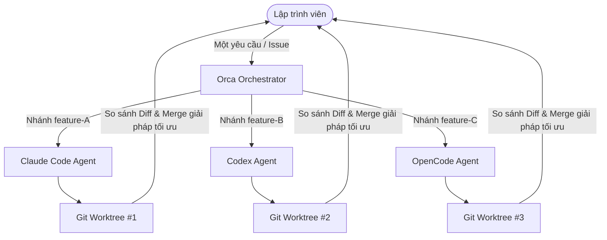
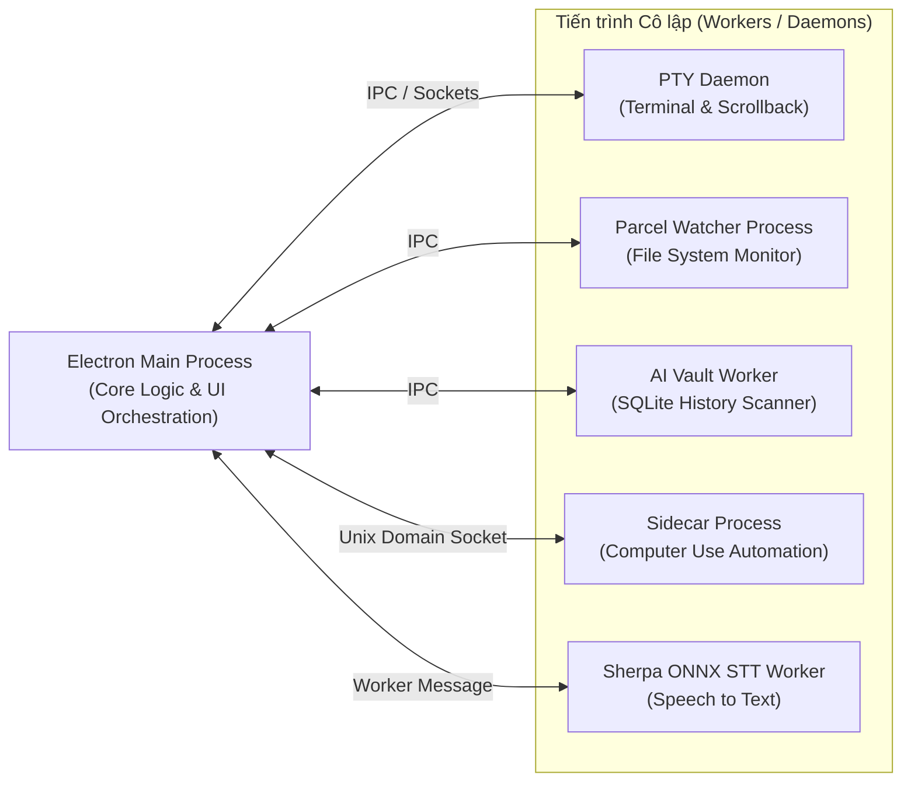

# Chương 01: Giới Thiệu & Triết Lý Kiến Trúc Orca

> *"The AI Orchestrator for 100x builders — Chạy Codex, ClaudeCode, OpenCode hay Pi song song, mỗi agent trong một git worktree riêng biệt, quản lý tập trung tại một nơi."*

  

---

## 1.1. Orca là gì?

**Orca** không phải là một trình soạn thảo code thông thường gắn thêm tiện ích chat AI. Orca là một **AI Orchestration IDE** thế hệ mới, được thiết kế chuyên biệt để giải quyết bài toán lớn nhất của kỷ nguyên lập trình với AI: **Điều phối và chạy song song nhiều AI Coding Agents độc lập mà không gây xung đột mã nguồn**.

### Vấn đề của IDE truyền thống (VS Code, Cursor, Zed...)
1. **Xung đột mã nguồn**: Khi bạn để 2 hay nhiều AI Agent chạy cùng lúc trong một thư mục dự án, chúng sẽ ghi đè file của nhau, gây ra lỗi build và mất mát dữ liệu.
2. **Không gian làm việc bị khóa**: Khi một agent đang phân tích hoặc chạy test, bạn phải đợi agent xong thì mới có thể thao tác tiếp trên branch đó.
3. **Mất dấu tiến trình**: Chạy nhiều cửa sổ terminal riêng lẻ khiến bạn không biết agent nào đang chạy, agent nào đang chờ user trả lời câu hỏi, và agent nào đã hoàn thành nhiệm vụ.

### Giải pháp đột phá từ Orca
- **Mỗi Agent = Một Git Worktree riêng**: Tách biệt hoàn toàn không gian đĩa, file, và branch. Các agent có thể cài đặt package, chạy test, sửa mã song song 100% không ảnh hưởng lẫn nhau.
- **Theo dõi trạng thái thời gian thực (Agent Hooks)**: Nhận diện tự động trạng thái của hơn 39 loại AI Agent (Idle, Running, Asking Question, Error, Done).
- **Hệ thống So sánh Đột phá (Annotate AI Diffs)**: Đặt nhận xét trực tiếp lên từng dòng diff của các agent để yêu cầu chỉnh sửa, sau đó merge phiên bản tốt nhất.

---

## 1.2. Đơn vị trung tâm: Phiên Agent trong Worktree

Trong các IDE truyền thống, đơn vị trung tâm là **"Tập tin đang mở" (Open File Buffer)**. Mọi thanh công cụ, tab và phím tắt đều phục vụ việc mở và gõ code trong file.

Ngược lại, trong **Orca**, đơn vị trung tâm là **"Một phiên Agent đang chạy trong một Workspace/Worktree cô lập"**. 
Tất cả các thành phần khác trong Orca:
- **Terminal WebGL**
- **Trình duyệt nhúng (Embedded Chromium)**
- **Monaco Editor**
- **Git Inspector & Diff Viewer**

đều đóng vai trò là khung nhìn (framing & observing) để lập trình viên giám sát, can thiệp và chỉ đạo hành động của các Agent.

---

## 1.3. Triết lý kiến trúc: "Process-Per-Risk"

Một trong những quyết định kỹ thuật cốt lõi giúp Orca đạt được độ ổn định vượt trội là mô hình **Process-Per-Risk (Mỗi rủi ro một tiến trình riêng)**. 

Bất kỳ thành phần nào có khả năng bị treo (hang), tiêu tốn nhiều bộ nhớ hoặc gây sập (crash) đều được chuyển ra ngoài tiến trình chính (Main Process) của Electron:

### Lợi ích thực tế:
- **PTY Daemon sống sót độc lập**: Khi bạn vô tình tắt ứng dụng hoặc ứng dụng khởi động lại, các tiến trình terminal dài hạn (như build Docker, dev server, agent đang chạy) vẫn tiếp tục hoạt động ngầm và không bị mất lịch sử dòng lệnh (scrollback).
- **File Watcher an toàn**: Việc quét hàng trăm nghìn file trong các dự án monorepo khổng lồ không làm giật lag giao diện người dùng.

---

## 1.4. Hệ sinh thái 39+ AI Agents First-Class

Orca hỗ trợ nguyên lý: *"Bất kỳ CLI Agent nào chạy được trong terminal thì đều chạy được trong Orca"*. Ngoài ra, Orca tích hợp bộ nhận diện chuyên sâu (first-class normalizer) cho hơn 39 CLI Agents phổ biến nhất thế giới.

  

| Phân nhóm | Danh sách Agent tiêu biểu |
| :--- | :--- |
| **Phổ biến hàng đầu** | Claude Code, OpenAI Codex, OpenCode, Google Gemini, Pi, Antigravity |
| **Chuyên sâu cho Developer** | Aider, Goose, Amp, Cline, Cursor CLI, Kimi Code, Qwen Code |
| **Tự động hóa & Doanh nghiệp** | Devin CLI, GitHub Copilot CLI, Grok CLI, Mistral Vibe, Rovo Dev |

Mỗi agent first-class đều được Orca tự động bắt sự kiện hook, nhận diện khi agent đang yêu cầu cấp quyền (permission prompt), hiển thị trạng thái tiêu thụ token, và hỗ trợ chuyển đổi nhanh tài khoản (Account Switching).

---

## 1.5. Tóm tắt chương & Bước tiếp theo

Trong chương này, bạn đã nắm vững:
1. Bản chất của Orca là IDE điều phối song song nhiều AI Agent.
2. Mô hình Git Worktree giúp loại bỏ xung đột mã nguồn khi chạy nhiều tác vụ cùng lúc.
3. Kiến trúc *Process-per-risk* mang lại sự bền bỉ cho hệ thống terminal và luồng dữ liệu.

👉 **Tiếp theo**: Chuyển sang [Chương 02: Cài Đặt & Khởi Tạo Môi Trường](./02-cai-dat-khoi-tao.md) để bắt đầu cài đặt và thiết lập Orca trên máy tính của bạn.
