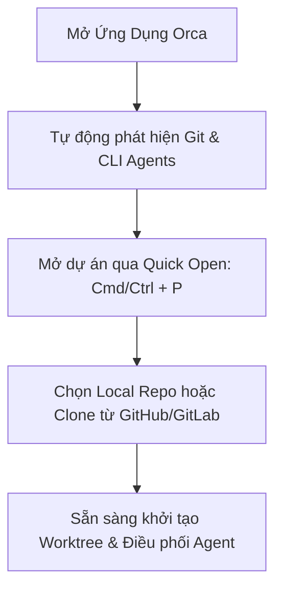

# Chương 02: Cài Đặt & Khởi Tạo Môi Trường

> Hướng dẫn chi tiết từng bước cài đặt phần mềm Orca trên macOS, Windows, Linux, cũng như chuẩn bị môi trường phát triển đầy đủ nhất.

---

## 2.1. Yêu Cầu Phần Cứng & Hệ Điều Hành

| Thành phần | Yêu cầu tối thiểu | Khuyến nghị cho Multi-Agent |
| :--- | :--- | :--- |
| **Hệ điều hành** | Windows 10/11 (64-bit), macOS 12+ (Apple Silicon/Intel), Linux (Ubuntu 20.04+, glibc 2.31+) | macOS Sonoma/Sequoia (Apple Silicon M-series) hoặc Windows 11 64-bit |
| **Bộ xử lý (CPU)** | 4 Cores | 8 Cores trở lên (để chạy 3-5 agent đồng thời) |
| **Bộ nhớ (RAM)** | 8 GB | 16 GB - 32 GB RAM |
| **Ổ cứng** | 2 GB dung lượng trống | 10 GB+ SSD NVMe (đáp ứng nhiều git worktrees) |
| **Công cụ Git** | Git 2.25 trở lên | Git bản mới nhất |

---

## 2.2. Hướng Dẫn Cài Đặt Cho Người Dùng Cuối (Desktop App)

### 1. macOS (Apple Silicon & Intel)
Bạn có thể cài đặt thông qua trình quản lý gói **Homebrew** hoặc tải trực tiếp file `.dmg`:

```bash
# Cài đặt qua Homebrew Cask
brew install --cask stablyai/orca/orca

# Hoặc phiên bản Release Candidate (RC) mới nhất
brew install --cask stablyai/orca/orca@rc
```
Nếu tải thủ công file `.dmg`, kéo biểu tượng **Orca.app** vào thư mục `/Applications`.

### 2. Windows (10/11 64-bit)
1. Tải bộ cài đặt chính thức `orca-windows-setup.exe` từ [onOrca.dev](https://onorca.dev/download).
2. Bản build được ký số bảo mật an toàn bởi **SignPath.io** (chứng chỉ SignPath Foundation).
3. Nhấp đúp vào file cài đặt và hoàn tất trong vài giây. Biểu tượng Orca sẽ xuất hiện trên Desktop và Start Menu.

### 3. Linux (Ubuntu, Debian, Fedora, Arch Linux)
- **AppImage**: Tải file `orca-linux.AppImage`, cấp quyền thực thi và chạy:
  ```bash
  chmod +x orca-linux.AppImage
  ./orca-linux.AppImage
  ```
- **Arch Linux (AUR)**:
  ```bash
  yay -S stably-orca-bin
  ```

---

## 2.3. Cấu Hình Môi Trường Cho Nhà Phát Triển (Build From Source)

Nếu bạn muốn đóng góp mã nguồn hoặc phát triển tính năng tùy chỉnh cho Orca:

### Các công cụ tiên quyết
- **Node.js**: Phiên bản **Node 24** (yêu cầu nghiêm ngặt theo `engines.node: "24"`).
- **pnpm**: Phiên bản **10.24.0** (pin sha512 trong `package.json`).
- **Toolchain C++**:
  - *Windows*: Visual Studio 2022 Build Tools (workload "Desktop development with C++"). Lưu ý: Không dùng VS 2026 vì node-gyp chưa hỗ trợ.
  - *macOS*: Xcode Command Line Tools (`xcode-select --install`).
  - *Linux*: `build-essential`, `python3`, `pkg-config`.

### Các bước khởi tạo dự án

```bash
# 1. Clone repository
git clone https://github.com/stablyai/orca.git
cd orca

# 2. Cài đặt toàn bộ dependencies và rebuild native modules
pnpm install

# 3. Chạy ứng dụng trong chế độ Development
pnpm dev
```

> [!NOTE]
> Dự án sử dụng **rolldown-vite**, **oxlint** và **oxfmt** để tối ưu hóa tốc độ build trên codebase hơn 15.000 files. Bạn không cần bất kỳ API key nào để khởi chạy môi trường dev cục bộ.

---

## 2.4. Khởi Chạy Ban Đầu & Thiết Lập Giao Diện

Sau khi mở ứng dụng lần đầu, bạn sẽ được chào đón bởi giao diện tối giản (Monochrome Frame) được thiết kế theo tiêu chuẩn `docs/STYLEGUIDE.md`:

<p align="center">
  
</p>



### Thiết lập các phím tắt quan trọng:
- **Mở bảng tìm kiếm nhanh (Quick Open)**: `⌘ P` (macOS) hoặc `Ctrl + P` (Windows/Linux).
- **Mở bảng lệnh (Command Palette)**: `⌘ ⇧ P` hoặc `Ctrl + Shift + P`.
- **Mở cài đặt (Settings)**: `⌘ ,` hoặc `Ctrl + ,`.
- **Mở / Đóng Terminal tích hợp**: `⌃ \`` hoặc `Ctrl + \``.

---

## 2.5. Tóm tắt chương & Bước tiếp theo

Bạn đã hoàn thành cài đặt Orca và nắm được các phím tắt cơ bản để tương tác với hệ thống.

👉 **Tiếp theo**: Chuyển sang [Chương 03: Không Gian Làm Việc & Quản Lý Worktree](./03-khong-gian-lam-viec-worktree.md) để tìm hiểu cách tạo và cô lập mã nguồn cho từng Agent.
