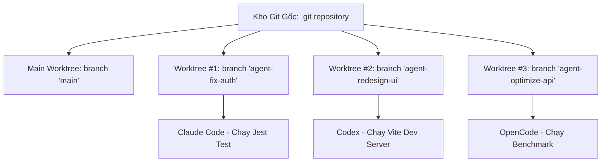
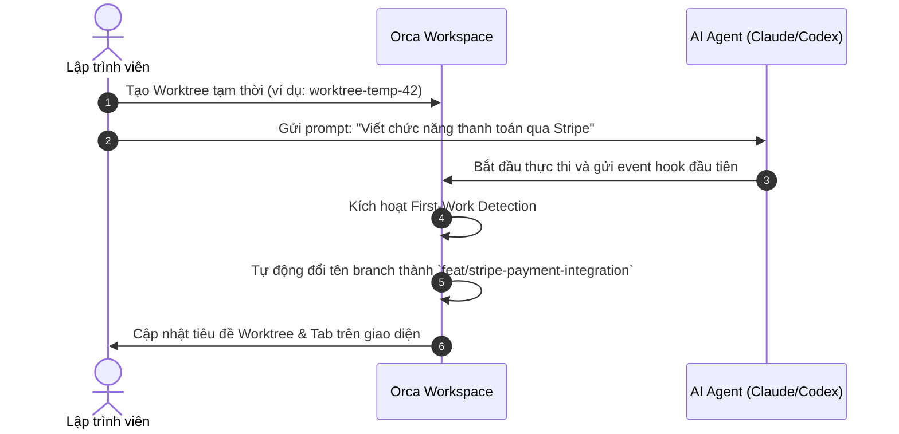

# Chương 03: Không Gian Làm Việc & Quản Lý Worktree

> Khám phá cơ chế Git Worktree độc lập và Folder Workspace — nền tảng giúp Orca cô lập hoàn toàn môi trường làm việc của từng AI Agent.

  

---

## 3.1. Hiểu Về Git Worktree Trong Orca

Thông thường, với Git truyền thống, khi bạn chuyển nhánh (`git checkout <branch>`), toàn bộ thư mục làm việc của bạn sẽ bị thay đổi file theo nhánh đó. Điều này khiến bạn chỉ có thể chạy một Agent tại một thời điểm trên một nhánh.

**Git Worktree** là tính năng mạnh mẽ của Git cho phép bạn gắn nhiều nhánh (branches) vào nhiều thư mục vật lý khác nhau cùng lúc trên đĩa, nhưng vẫn dùng chung một cơ sở dữ liệu lịch sử `.git`:

### Lợi ích trong Orca:
1. **Cô lập tuyệt đối**: Agent 1 sửa file không làm ảnh hưởng đến quá trình build/test của Agent 2.
2. **Tiết kiệm dung lượng**: Không cần `git clone` lại toàn bộ repo nặng nề; các worktree chia sẻ chung object database của Git gốc.
3. **Chuyển đổi tức thời**: Bạn có thể nhảy qua lại giữa các màn hình làm việc của từng agent chỉ bằng một cú nhấp chuột hoặc phím tắt.

---

## 3.2. Git Worktree vs. Folder Workspace

Orca coi cả hai loại workspace sau là công dân hạng nhất (first-class citizens):

| Tiêu chí | Git Worktree Workspace | Folder Workspace (Non-git) |
| :--- | :--- | :--- |
| **Mục đích** | Các dự án có quản lý phiên bản với Git | Thư mục mã nguồn không dùng Git, dự án tạm thời |
| **Quản lý nhánh** | Tự động tạo branch riêng (`worktree/<name>`) | Không có branch, thao tác trực tiếp trên thư mục |
| **So sánh Diff** | Hỗ trợ full Git diff, branch diff, commit diff | Hỗ trợ snapshot diff & folder comments |
| **Thu hồi & Dọn dẹp** | Hỗ trợ Worktree Trash & Safe Recovery | Xóa thư mục vào Thùng rác hệ điều hành (OS Trash) |

---

## 3.3. Tính Năng Tự Động Đặt Tên Thông Minh (Auto-Naming)

Một trải nghiệm cực kỳ tiện lợi trong Orca: **Bạn không cần phải mất thời gian suy nghĩ tên branch hay tên workspace trước khi bắt đầu!**

Cơ chế này được vận hành bởi 3 module chuyên biệt trong lõi Orca:
- `first-work-branch-rename`: Tự động đặt tên branch chuẩn theo ngữ cảnh công việc.
- `first-work-folder-rename`: Tự động đổi tên thư mục làm việc tương ứng.
- `first-work-workspace-title-rename`: Cập nhật tiêu đề tab hiển thị trực quan trên thanh tiêu đề.

---

## 3.4. Các Thao Tác Quản Lý Worktree Trong Thực Tế

  

### 1. Tạo mới một Worktree
- Bấm tổ hợp phím `⌘ N` (macOS) hoặc `Ctrl + N` (Windows/Linux) khi đang ở màn hình Workspace.
- Hoặc bấm vào biểu tượng dấu cộng `+` ở thanh bên trái (Worktree List).
- Bạn có thể chọn tạo từ nhánh hiện tại, tạo từ nhánh `main`, hoặc checkout một Pull Request từ GitHub/GitLab.

### 2. Chuyển đổi nhanh giữa các Worktree
- Sử dụng **Quick Open**: Bấm `⌘ P` (macOS) hoặc `Ctrl + P` (Windows/Linux) và gõ tên branch hoặc tên tác vụ của agent.
- Sử dụng phím tắt điều hướng nhanh: `⌥ 1`, `⌥ 2`, `⌥ 3` (hoặc `Alt + 1/2/3`) để chuyển ngay lập tức đến worktree tương ứng.

### 3. Xóa và Khôi Phục Worktree (Worktree Trash & Safe Recovery)
- Khi một agent hoàn thành công việc và code đã được merge, bạn có thể bấm chuột phải vào Worktree và chọn **Delete / Archive**.
- **Cơ chế an toàn**: Orca không xóa vĩnh viễn ngay mà đưa vào **Worktree Trash**. Nếu bạn lỡ xóa nhầm một worktree chứa code chưa commit, bạn có thể dễ dàng khôi phục lại nguyên vẹn trạng thái thông qua bảng *Worktree Recovery Panel*.

---

## 3.5. Tóm tắt chương & Bước tiếp theo

Trong chương này, bạn đã hiểu rõ:
- Cách thức Git Worktree giúp cô lập môi trường của các Agent song song.
- Khả năng tự động đặt tên thông minh từ yêu cầu đầu tiên của bạn.
- Quy trình tạo, chuyển đổi và phục hồi worktree an toàn.

👉 **Tiếp theo**: Chuyển sang [Chương 04: Điều Phối & Quản Trị Hệ Thống AI Agents](./04-dieu-phoi-quan-ly-ai-agents.md) để tìm hiểu cách kết nối và điều phối hơn 39 loại AI Agent cùng lúc.
