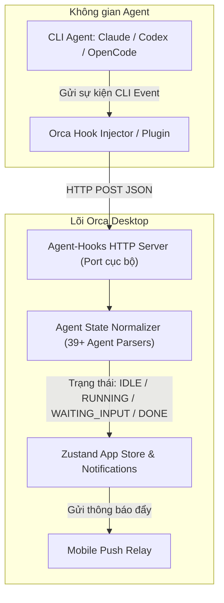
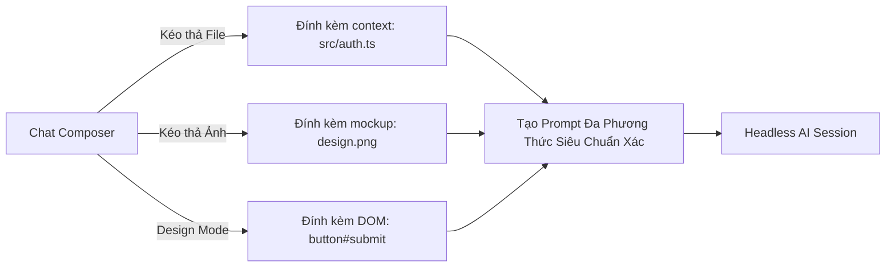

# Chương 04: Điều Phối & Quản Trị Hệ Thống AI Agents

> Hướng dẫn toàn diện về cơ chế điều phối 39+ AI Agent, hệ thống Agent-Hooks thời gian thực, giao diện Native Chat, quản lý tài khoản & hạn mức tiêu thụ token.

  

---

## 4.1. Cơ Chế Agent-Hooks: Giám Sát Trạng Thái Tự Động

Một trong những hạn chế lớn nhất khi chạy Agent trong terminal thông thường là bạn không biết khi nào Agent đã hoàn thành, hoặc Agent đang dừng lại chờ bạn gõ câu trả lời `[y/N]` để cấp quyền đọc/ghi file.

Orca giải quyết điều này bằng một **HTTP Agent-Hooks Server cục bộ**:

### Các trạng thái chuẩn hóa của Agent trong Orca:
1. `idle`: Agent đang rảnh rỗi, sẵn sàng nhận prompt mới.
2. `running`: Agent đang phân tích mã nguồn, sinh code hoặc chạy lệnh terminal.
3. `waiting_for_input`: Agent đang hỏi câu hỏi hoặc chờ bạn xác nhận (Permission Request).
4. `done`: Tác vụ đã hoàn tất thành công.
5. `errored`: Gặp lỗi trong quá trình thực thi.

---

## 4.2. Giao Diện Native Chat vs. TUI Terminal

Orca hỗ trợ hai phương thức tương tác chính với Agent:

| Đặc điểm | TUI Mode (Terminal Giao diện dòng lệnh) | Native Chat Mode (Giao diện đồ họa) |
| :--- | :--- | :--- |
| **Giao diện** | Màn hình terminal xterm cổ điển | Khung hội thoại hiện đại (Chat Composer) |
| **Tệp đính kèm** | Phải gõ đường dẫn thủ công | **Kéo thả trực tiếp file, ảnh, tài liệu vào ô chat** |
| **Thẻ tương tác** | Chọn phím số trên terminal | **Interactive Cards** (Approval Card, Question Card, Tool Run Card) |
| **Xem trước Diff** | Dạng text thuần (git diff) | **Monaco Diff Viewer trực quan với Syntax Highlight** |

  

---

## 4.3. Quản Lý Tài Khoản & Hạn Mức (Usage Tracking & Hot-Swap)

Lập trình viên chuyên nghiệp thường sử dụng nhiều tài khoản (tài khoản cá nhân, tài khoản công ty, các gói Max/Pro khác nhau). Orca cung cấp trình quản lý tài khoản chuyên sâu:

  

### 1. Hot-Swap tài khoản không cần đăng nhập lại
- Hỗ trợ đổi tài khoản **Claude Code** và **Codex** ngay lập tức trong phần cài đặt hoặc góc dưới thanh trạng thái.
- Tự động lưu trữ `CODEX_HOME` và keychain riêng biệt cho từng tài khoản mà không gây xung đột session token.

### 2. Theo dõi Quota & Rate Limit Reset
- Hiển thị phần trăm số token đã dùng trong ngày / trong chu kỳ thanh toán.
- Dự đoán chính xác thời gian được reset quota của nhà cung cấp (Claude / OpenAI / OpenCode).

---

## 4.4. AI Vault: Trình Duyệt Lịch Sử Phiên Đa Mô Hình

**AI Vault** là kho lưu trữ trung tâm của toàn bộ lịch sử trò chuyện và phiên làm việc của tất cả các Agent trên máy tính của bạn:

- **Tìm kiếm toàn văn (Full-text Search)**: Tìm lại các đoạn code, giải pháp đã từng được bất kỳ agent nào sinh ra từ vài tháng trước.
- **Khôi phục phiên (Resume Session)**: Bấm vào một phiên cũ để mở lại đúng worktree và tiếp tục hội thoại với agent từ vị trí dừng lại trước đó.
- **Tiến trình cô lập**: AI Vault chạy trên worker SQLite riêng (`session-scanner-*-entry.ts`), đảm bảo việc lập chỉ mục lịch sử không gây đứng app.

---

## 4.5. Tóm tắt chương & Bước tiếp theo

Trong chương này, bạn đã nắm được:
- Cách Agent-Hooks tự động bắt trạng thái chạy của 39+ loại Agent.
- Ưu thế vượt trội của Native Chat với kéo thả tệp và thẻ tương tác đồ họa.
- Quản lý tài khoản nhiều profile và lưu trữ lịch sử xuyên suốt với AI Vault.

👉 **Tiếp theo**: Chuyển sang [Chương 05: Terminal Đa Nhiệm & Hệ Thống PTY Daemon](./05-terminal-split-xterm.md) để tìm hiểu sâu về hệ thống terminal hiệu năng cao trong Orca.
