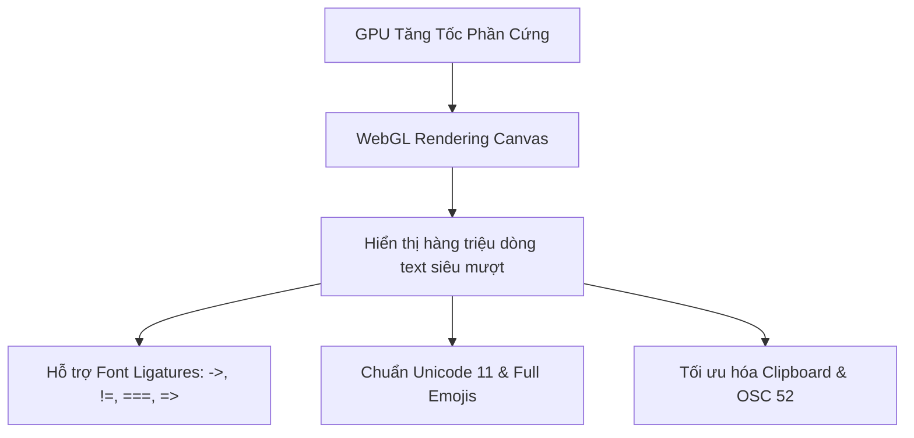
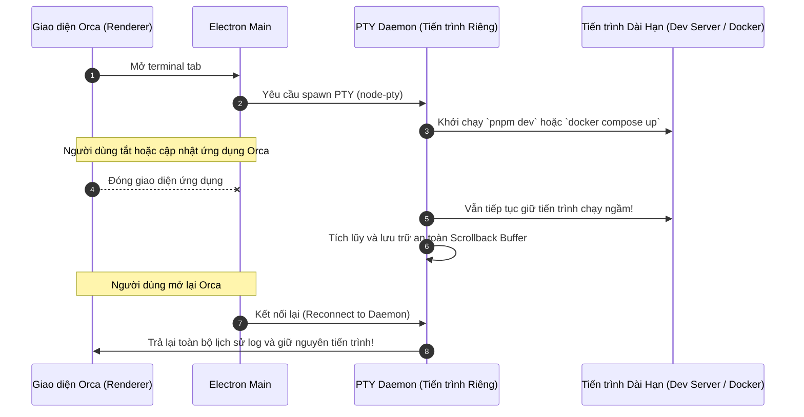

# Chương 05: Terminal Đa Nhiệm & Hệ Thống PTY Daemon

> Khám phá kiến trúc Terminal Ghostty-class WebGL, khả năng chia màn hình vô hạn và cơ chế PTY Daemon giúp bảo toàn scrollback ngay cả khi thoát ứng dụng.

<p align="center">
  
</p>

---

## 5.1. Công Nghệ Terminal Ghostty-Class & Render WebGL

Orca xây dựng hệ thống terminal dựa trên lõi **`@xterm/xterm` thế hệ mới** kết hợp công nghệ tăng tốc phần cứng **WebGL**:



### Các ưu điểm vượt trội:
- **Tốc độ phản hồi 60+ FPS**: Không có hiện tượng giật khung hình khi các agent xả hàng chục nghìn dòng log build ra màn hình.
- **Hỗ trợ Ligatures trọn vẹn**: Tự động hiển thị các ký tự nối dấu của các font lập trình hiện đại như *Fira Code*, *JetBrains Mono*, *Cascadia Code*.
- **Tương thích hoàn toàn với TUI**: Render sắc nét các ứng dụng giao diện dòng lệnh phức tạp như `htop`, `lazygit`, `k9s`, `tmux`.

---

## 5.2. PTY Daemon: Scrollback & Process Sống Sót Qua Việc Khởi Động Lại

Trong các IDE thông thường, khi bạn tắt ứng dụng hoặc ứng dụng bị crash, toàn bộ terminal tab đang chạy sẽ chết theo và lịch sử dòng lệnh bị xóa sạch.

Trong Orca, **PTY Daemon** được tách thành một tiến trình nền độc lập:



---

## 5.3. Bố Cục Chia Màn Hình Vô Hạn (Infinite Splits)

Orca cho phép bạn tùy biến không gian làm việc bằng cách chia màn hình theo mọi hướng:

<p align="center">
  
</p>

```
+------------------------------------+------------------------------------+
|  Pane 1: Agent Claude (TUI / Logs) |  Pane 2: Agent Codex (Testing)     |
|  $ claude                          |  $ pnpm test:watch                 |
|  > Analyzing repository structure  |  PASS src/auth.test.ts             |
+------------------------------------+------------------------------------+
|  Pane 3: Vite Dev Server           |  Pane 4: Git Status / Lazygit      |
|  VITE v6.0 ready on localhost:3000 |  On branch worktree/feature-xyz    |
+------------------------------------+------------------------------------+
```

### Bảng phím tắt thao tác Terminal & Split Panes:

| Thao tác | macOS | Windows / Linux |
| :--- | :--- | :--- |
| **Chia đôi màn hình theo chiều dọc** | `⌘ D` | `Ctrl + Shift + D` |
| **Chia đôi màn hình theo chiều ngang** | `⌘ ⇧ D` | `Ctrl + Shift + E` |
| **Chuyển đổi tiêu điểm giữa các Pane** | `⌘ [` / `⌘ ]` | `Alt + Phím Mũi Tên` |
| **Đóng Pane hiện tại** | `⌘ W` | `Ctrl + W` |
| **Phóng to cực đại (Toggle Maximize) Pane** | `⌘ ⇧ M` | `Ctrl + Shift + M` |
| **Tìm kiếm trong Scrollback** | `⌘ F` | `Ctrl + F` |
| **Xóa màn hình Terminal** | `⌘ K` | `Ctrl + K` |

---

## 5.4. Cơ Chế Backpressure & Headless Terminal

Khi một script in ra dữ liệu quá nhanh (hàng gigabyte text trong vài giây), giao diện renderer thông thường sẽ bị quá tải DOM.

Orca áp dụng cơ chế **PTY Delivery với ACK + Backpressure**:
- Renderer xác nhận (ACK) sau mỗi lô dữ liệu hiển thị thành công.
- Nếu renderer chưa kịp vẽ, PTY Daemon sẽ tự động điều tiết tốc độ truyền tải (throttling), ngăn ngừa hoàn toàn tình trạng tràn bộ nhớ (Out-Of-Memory).
- **Headless Terminal Mode**: Với các tab terminal đang ở chế độ ẩn (background tab), xterm chạy ở dạng headless trong main process để tiếp tục theo dõi trạng thái mà không tiêu tốn tài nguyên GPU render.

---

## 5.5. Tóm tắt chương & Bước tiếp theo

Trong chương này, bạn đã tìm hiểu:
- Công nghệ WebGL render terminal với hiệu năng đỉnh cao và hỗ trợ ligatures.
- Khả năng bền bỉ của PTY Daemon giúp giữ nguyên tiến trình khi tắt app.
- Cách tổ chức split layout linh hoạt và cơ chế chống tràn bộ nhớ với Backpressure.

👉 **Tiếp theo**: Chuyển sang [Chương 06: Trình Duyệt Tích Hợp & Design Mode](./06-design-mode-trinh-duyet.md) để khám phá cách gửi trực tiếp thành phần UI vào câu lệnh cho Agent.
