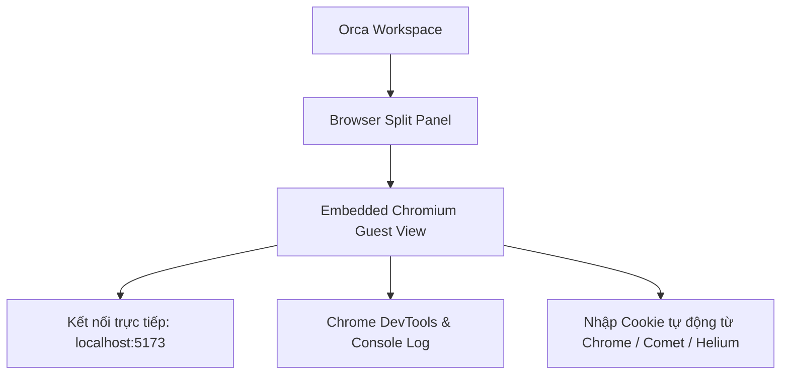
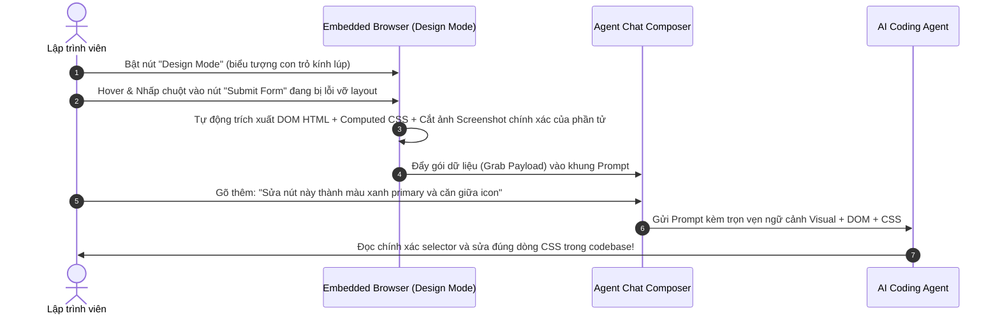

# Chương 06: Trình Duyệt Tích Hợp & Design Mode

> Tận dụng trình duyệt Chromium nhúng trong Orca, khai phá tính năng Design Mode ("Grab Tool") để gửi trực tiếp phần tử UI vào prompt của Agent, và tìm hiểu cơ chế Computer Use.

  

---

## 6.1. Trình Duyệt Chromium Tích Hợp (Embedded Browser)

Orca tích hợp một hệ thống trình duyệt Chromium đầy đủ ngay bên trong cửa sổ làm việc:

### Điểm đặc sắc của trình duyệt nhúng trong Orca:
1. **Chia sẻ Session Cookies**: Có khả năng tự động nhập cookie từ trình duyệt bên ngoài (Google Chrome, Brave, Arc, v.v.), giúp bạn kiểm thử các trang web yêu cầu đăng nhập phức tạp mà không cần gõ lại mật khẩu hay mã 2FA.
2. **Tự động reload khi Worktree build xong**: Đồng bộ với chu kỳ build của từng worktree tương ứng.
3. **CDP Screencast**: Truyền phát hình ảnh chất lượng cao và giao tiếp chuẩn Chrome DevTools Protocol.

---

## 6.2. Tính Năng Design Mode ("Grab Tool")

**Design Mode** là một trong những tính năng đột phá nhất của Orca dành cho các nhà phát triển Frontend và Fullstack.

Thay vì phải chụp màn hình thủ công, mở file inspector, copy selector rồi viết prompt dài dòng giải thích cho Agent, bạn chỉ cần thực hiện 3 bước:

### Dữ liệu được Design Mode tự động trích xuất (`browser-grab-payload`):
- **Cấu trúc DOM**: Mã HTML của phần tử được chọn và các thẻ cha liên quan.
- **Computed Styles**: Toàn bộ thuộc tính CSS thực tế đang được áp dụng (margin, padding, flexbox, colors, z-index).
- **Tọa độ & Kích thước**: `BoundingClientRect` (width, height, top, left).
- **Ảnh chụp cắt sẵn (Cropped Screenshot)**: Ảnh PNG độ nét cao của đúng vùng phần tử đó.

---

## 6.3. Tính Năng Computer Use & Sidecar

Ngoài việc đọc DOM, Orca hỗ trợ **Computer Use** — cho phép AI Agent trực tiếp thao tác và điều khiển giao diện desktop hoặc trình duyệt:

- **Điều khiển chuột & bàn phím**: Di chuyển con trỏ, nhấp chuột (`click`), nhập liệu form (`fill`), cuộn trang (`scroll`).
- **Chụp ảnh toàn cảnh (Full Snapshot)**: Agent có thể chụp ảnh màn hình để tự thẩm định xem giao diện sau khi sửa đã đúng yêu cầu thiết kế chưa.
- **Kiến trúc Sidecar an toàn**: Module điều khiển chạy trong một tiến trình sidecar độc lập (`sidecar-entry.ts`), kết nối an toàn qua Unix Domain Socket trên macOS và script automation đa nền tảng.

---

## 6.4. Emulator Streaming: Giám Sát Thiết Bị Di Động

Đối với các dự án phát triển ứng dụng di động (React Native, Flutter, Swift, Kotlin):
- Orca hỗ trợ **Emulator Bridge** và truyền phát luồng hình ảnh (`emulator-frame-stream` / `emulator-video-stream`).
- Bạn có thể xem trực tiếp màn hình máy ảo Android/iOS đang chạy ngay bên cạnh cửa sổ code của Agent mà không cần mở nhiều cửa sổ giả lập lộn xộn trên màn hình.

  

---

## 6.5. Tóm tắt chương & Bước tiếp theo

Trong chương này, bạn đã học được:
- Cách tận dụng trình duyệt Chromium nhúng với cookie import.
- Sức mạnh của Design Mode giúp đưa ngữ cảnh UI trực quan vào prompt trong 1 giây.
- Khả năng tự động hóa kiểm thử giao diện thông qua Computer Use và Emulator Streaming.

👉 **Tiếp theo**: Chuyển sang [Chương 07: Làm Việc Từ Xa Qua SSH & Môi Trường WSL](./07-ssh-remote-worktree.md) để mở rộng không gian phát triển lên các máy chủ cấu hình khủng.
