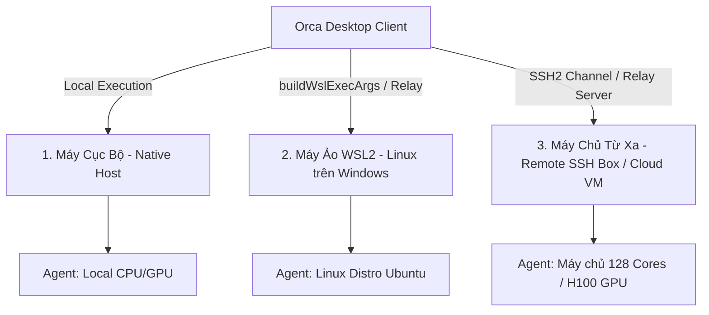
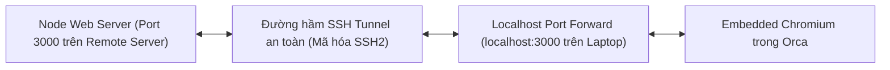

# Chương 07: Làm Việc Từ Xa Qua SSH & Môi Trường WSL

> Mở rộng năng lực xử lý: Hướng dẫn kết nối và điều phối Agent trên máy chủ Remote SSH cấu hình cao, máy ảo WSL2 và môi trường Cloud Dev Box.

  

---

## 7.1. Ba Môi Trường Thực Thi (Execution Hosts) Ngang Hàng

Trong Orca, máy tính của bạn không phải là nơi duy nhất để code và chạy agent. Orca thiết kế 3 môi trường thực thi bình đẳng:

### Tại sao cần SSH Worktree?
- **Sức mạnh điện toán vô hạn**: Bạn có thể dùng laptop mỏng nhẹ nhưng điều phối 5-10 agent biên dịch các dự án C++, Rust, AI Model khổng lồ trên máy chủ từ xa 64-128 lõi CPU.
- **Tiết kiệm pin & băng thông máy cá nhân**: Mọi tác vụ tải thư viện, chạy test, build container đều diễn ra trên cloud datacenter tốc độ cao.

---

## 7.2. Cấu Hình & Kết Nối SSH Worktree

### 1. Thêm cấu hình SSH Host
Trong Orca, mở **Settings** -> **SSH Hosts** (hoặc gõ `⌘ ⇧ P` -> `SSH: Add New Remote Host`):
- **Host Name / IP**: `dev-server.mycompany.internal` hoặc `192.168.1.100`
- **Username**: `ubuntu` hoặc `developer`
- **Authentication**: Khóa SSH Key (`~/.ssh/id_ed25519` hoặc `~/.ssh/id_rsa`)
- **Port**: `22` (mặc định)

### 2. Cơ chế Xác thực Khóa & Bảo mật (Host Key Verification)
- Orca tự động kiểm tra dấu vân tay khóa máy chủ (`Host Key Fingerprint`) để chống tấn công Man-In-The-Middle.
- Thông tin định danh được lưu trữ an toàn, hỗ trợ cơ chế Strict Host Key Checking.

### 3. Tự động phục hồi kết nối (Auto-Reconnect & Source Recovery)
Nếu mạng Wifi của bạn bị chập chờn hoặc bạn đóng nắp laptop di chuyển giữa các phòng họp:
- Lõi SSH (`ssh-reconnect-source-recovery.ts`) tự động duy trì hàng đợi gói tin (queue).
- Khi có mạng trở lại, phiên SSH tự động kết nối lại ngầm mà không làm chết terminal của agent hay mất dữ liệu đang gõ dở.

---

## 7.3. Tự Động Chuyển Tiếp Cổng (Automatic Port Forwarding)

Khi Agent chạy lệnh khởi động một web server trên máy chủ remote (ví dụ: `pnpm dev` mở port `3000` hoặc `8080` trên Linux server):

- Orca tự động phát hiện port vừa được mở trên máy chủ từ xa nhờ module quét port (`port-scan-command-worker`).
- Tự động thiết lập đường hầm SSH tunnel đưa cổng đó về `localhost` trên máy tính của bạn.
- Bạn chỉ việc mở trình duyệt nhúng bên cạnh để xem kết quả ngay tức khắc.

---

## 7.4. Quy Tắc Tương Thích Giao Thức (Remote Wire Compatibility)

Khi sử dụng Orca với máy chủ từ xa chạy daemon `orca serve`:
- **Phiên bản độc lập**: Bản desktop trên máy bạn và bản `orca serve` trên server có thể lệch version (ví dụ Desktop v1.4.180, Server v1.4.175).
- **Quy tắc An toàn**: 
  - Các trường dữ liệu mới luôn là dạng tùy chọn (optional).
  - Các opcode mới trong luồng stream đều phải trải qua bước đàm phán khả năng (Capability Negotiation) trước khi kích hoạt.
  - Đảm bảo hệ thống hoạt động ổn định 100% không bao giờ bị crash vì không tương thích phiên bản.

---

## 7.5. Tóm tắt chương & Bước tiếp theo

Trong chương này, bạn đã nắm vững:
- Cách tận dụng sức mạnh máy chủ từ xa qua SSH Worktrees.
- Tính năng tự phục hồi kết nối thông minh khi mạng gián đoạn.
- Cơ chế tự động Port Forwarding và tính tương thích bền vững của Remote Wire Protocol.

👉 **Tiếp theo**: Chuyển sang [Chương 08: Quản Lý Source Control & Đánh Giá Code AI](./08-git-review-annotate-diff.md) để tìm hiểu cách đánh giá và đóng góp nhận xét cho code do AI sinh ra.
