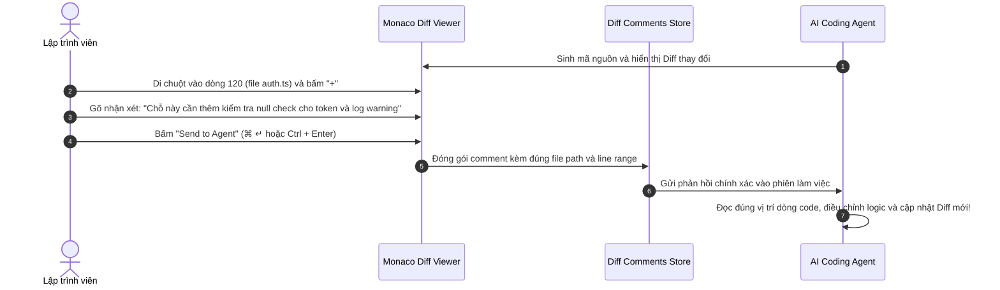
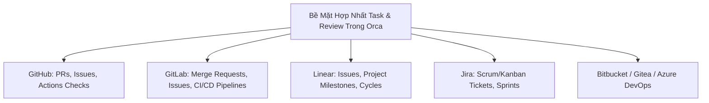

# Chương 08: Quản Lý Source Control & Đánh Giá Code AI

> Làm chủ quy trình kiểm thử và đánh giá mã nguồn do AI sinh ra, tính năng Annotate AI Diffs độc quyền và tích hợp liền mạch với GitHub, GitLab, Linear, Jira.

  

---

## 8.1. Kiểm Soát Thay Đổi Mã Nguồn Với Monaco Diff Viewer

Khi AI Agent thực hiện thay đổi hàng chục file trong dự án, việc xem xét cẩn thận từng dòng code là yếu tố sống còn để đảm bảo chất lượng phần mềm.

Orca trang bị trình **Monaco Diff Viewer chuyên sâu**:
- **Hiển thị song song (Side-by-side) hoặc Gộp dòng (Inline Diff)**.
- **Tô màu cú pháp (Syntax Highlighting) theo thời gian thực**.
- **Cây thư mục thay đổi thông minh**: Đánh dấu rõ ràng các file được thêm mới `[+]`, sửa đổi `[M]`, xóa `[-]` hoặc đổi tên `[R]`.

---

## 8.2. Tính Năng Đột Phá: Annotate AI Diffs

Một trong những tính năng hữu ích nhất của Orca là **Annotate AI Diffs**. Thay vì bạn phải tự sửa code bằng tay hoặc copy-paste code ra cửa sổ chat rồi giải thích "hãy sửa hàm ở dòng 45...", bạn có thể thao tác trực tiếp trên giao diện Diff:

### Lợi thế vượt bậc:
- **Độ chính xác tuyệt đối**: Agent nhận được chính xác tên file, số dòng (`#L120-L125`), đoạn mã xung quanh và yêu cầu chỉnh sửa của bạn.
- **Tiết kiệm token**: Không cần phải gửi lại toàn bộ file vào prompt; chỉ gửi ngữ cảnh thay đổi cần thiết.

---

## 8.3. Tự Động Sinh Commit Message & PR Description Bằng AI

Khi đã hài lòng với kết quả của Agent, Orca cung cấp các công cụ hỗ trợ đóng gói mã nguồn:

- **AI Commit Message Generation**: Phân tích toàn bộ diff thay đổi trong worktree và tự động tạo commit message chuẩn theo quy ước *Conventional Commits* (ví dụ: `feat(auth): add null-safety validation to bearer token parser`).
- **AI PR Description Generator**: Tự động viết mô tả Pull Request chi tiết gồm: Tóm tắt thay đổi (Summary), Các bước kiểm thử (Testing Steps), Rủi ro tiềm ẩn (Breaking Changes).

---

## 8.4. Tích Hợp Đa Nền Tảng Forge & Issue Trackers

Theo triết lý của Orca, **khái niệm Source Control và Review không bị trói buộc vào chỉ riêng GitHub**, mà mở rộng công bằng cho mọi nền tảng quản lý dự án hàng đầu thế giới:

  

### Quy trình làm việc không chuyển đổi ngữ cảnh (Zero Context-Switch):
1. Mở danh sách **Linear Issues** hoặc **GitHub Issues** ngay trong Orca.
2. Bấm vào một issue bất kỳ -> Chọn **"Open Worktree for this Task"**.
3. Orca tự động tạo một Worktree mới, đặt tên nhánh theo mã issue (ví dụ: `linear/eng-402-fix-payment-timeout`).
4. Agent tự động đọc nội dung mô tả của issue và bắt tay vào giải quyết.
5. Sau khi hoàn thành, tạo Pull Request và cập nhật ngược lại trạng thái "In Review" trên Linear/Jira chỉ với 1 click.

---

## 8.5. Tóm tắt chương & Bước tiếp theo

Trong chương này, bạn đã học được:
- Cách kiểm tra mã nguồn trực quan với Monaco Diff Viewer.
- Cách sử dụng Annotate AI Diffs để hướng dẫn Agent chỉnh sửa chi tiết từng dòng code.
- Tận dụng AI sinh commit message/PR và quy trình phối hợp trơn tru cùng GitHub, GitLab, Linear, Jira.

👉 **Tiếp theo**: Chuyển sang [Chương 09: Điều Khiển Qua Ứng Dụng Di Động & Thông Báo](./09-mobile-companion-thong-bao.md) để giám sát và chỉ đạo Agent từ điện thoại thông minh của bạn.
