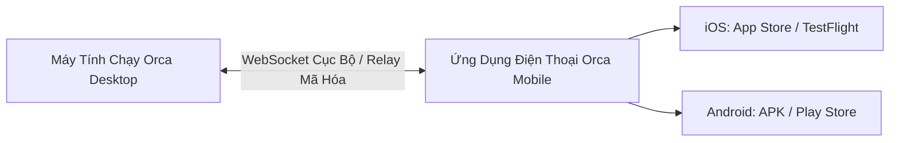
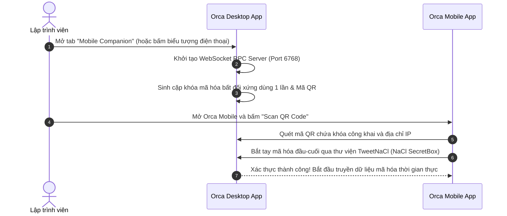

# Chương 09: Điều Khiển Qua Ứng Dụng Di Động & Thông Báo

> Giám sát và điều phối các AI Agent mọi lúc mọi nơi với ứng dụng Orca Mobile Companion trên iOS và Android.

  

---

## 9.1. Giới Thiệu Ứng Dụng Orca Mobile Companion

Khi bạn giao một tác vụ lớn cho 3-5 Agent chạy song song (ví dụ: refactor toàn bộ cơ sở dữ liệu hoặc viết bộ test cho 50 components), bạn không nhất thiết phải ngồi dán mắt vào màn hình máy tính suốt nhiều giờ đồng hồ.

**Orca Mobile Companion** giúp bạn:
- Nhận thông báo tức thời ngay khi bất kỳ Agent nào làm xong bài toán.
- Nhận thông báo khi Agent cần bạn trả lời câu hỏi hoặc duyệt phân quyền.
- Xem trực tiếp log terminal đang chạy của từng Worktree ngay trên điện thoại.
- Gõ tiếp các chỉ đạo (follow-up prompts) để Agent tiếp tục công việc.

---

## 9.2. Quy Trình Ghép Nối Thiết Bị (Pairing) An Toàn

Orca áp dụng chuẩn bảo mật không tin cậy (Zero-Trust): Không yêu cầu tài khoản đám mây trung gian, dữ liệu của bạn không đi qua bất kỳ server bên thứ ba nào nếu cùng mạng LAN.

### Điểm kỹ thuật bảo mật cốt lõi:
- **TweetNaCl Encryption**: Toàn bộ luồng dữ liệu truyền giữa điện thoại và máy tính đều được mã hóa bằng thuật toán `x25519-xsalsa20-poly1305`.
- **Kiểm soát phiên bản Protocol (`protocol-version.ts`)**: Tự động kiểm tra độ tương thích giữa `DESKTOP_PROTOCOL_VERSION` và `MIN_COMPATIBLE_MOBILE_VERSION` để đảm bảo không xảy ra lỗi xung đột giao thức.

---

## 9.3. Giám Sát & Chỉ Đạo Tác Vụ Từ Xa

Sau khi ghép nối thành công, bạn có thể thực hiện mọi thao tác điều khiển ngay trên lòng bàn tay:

### 1. Bảng điều khiển Worktree di động
- Danh sách toàn bộ các Worktree đang hoạt động trên máy tính.
- Hiển thị chấm màu trạng thái trực quan:
  - 🟢 **Xanh lá**: Agent đang thực thi tác vụ.
  - 🟡 **Vàng**: Agent đang chờ bạn trả lời hoặc phê duyệt quyền (`Waiting for input`).
  - 🔵 **Xanh dương**: Agent đã hoàn thành công việc (`Done`).
  - 🔴 **Đỏ**: Gặp sự cố lỗi (`Errored`).

### 2. Giao diện Terminal di động tích hợp
- Orca Mobile tích hợp một engine xterm siêu nhẹ chạy mượt mà trên nền tảng di động.
- Hỗ trợ cuộn mượt mà xem toàn bộ lịch sử log, phím tắt đặc thù cho di động (phím Tab, Ctrl, ESC, Phím mũi tên).

### 3. Gửi Prompt & Phê duyệt nhanh
- Gõ prompt bằng giọng nói (Voice-to-Text) hoặc bàn phím điện thoại.
- Bấm **"Approve"** hoặc **"Reject"** các đề xuất thay đổi file của agent chỉ với 1 chạm.

---

## 9.4. Tóm tắt chương & Bước tiếp theo

Trong chương này, bạn đã nắm vững:
- Lợi ích của việc tự do rời bàn làm việc nhờ ứng dụng Orca Mobile.
- Cơ chế ghép nối mã hóa an toàn qua mã QR và thư viện TweetNaCl.
- Khả năng theo dõi trạng thái, xem log và gửi chỉ thị cho Agent từ xa.

👉 **Tiếp theo**: Chuyển sang [Chương 10: Tự Động Hóa Với Bộ Lệnh Orca CLI](./10-orca-cli-tu-dong-hoa.md) để tìm hiểu cách viết kịch bản tự động hóa và cho phép Agent tự điều khiển Orca.
