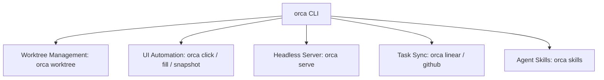
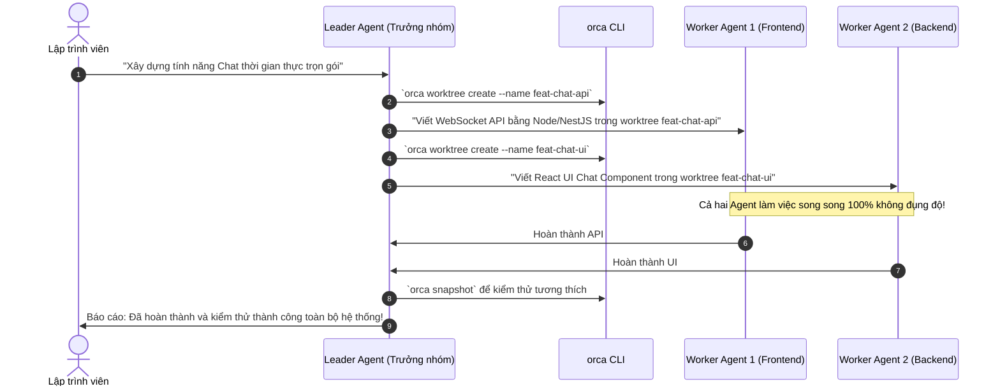

# Chương 10: Tự Động Hóa Với Bộ Lệnh Orca CLI

> Khám phá công cụ dòng lệnh `orca` CLI: Cho phép lập trình viên và chính các AI Agent tự động hóa mọi thao tác trong Orca qua script.

<p align="center">
  
</p>

---

## 10.1. Cài Đặt & Kiểm Tra Binary `orca` CLI

Orca đi kèm một binary CLI hoàn chỉnh (được biên dịch từ `src/cli/` ra `out/cli/index.js` và trình launcher native `orca.exe` trên Windows / symlink trên macOS/Linux).

### Cách cài đặt vào biến môi trường PATH:
- **Tự động từ giao diện**: Mở Orca Desktop -> Bấm `⌘ ⇧ P` (hoặc `Ctrl + Shift + P`) -> Gõ `Install 'orca' command in PATH`.
- **Kiểm tra cài đặt**:
  ```bash
  orca --version
  # Kết quả: orca v1.4.178
  ```

---

## 10.2. Danh Mục Các Lệnh CLI Cốt Lõi



### 1. Quản lý Worktree (`orca worktree`)
```bash
# Tạo một worktree mới từ branch hiện tại
orca worktree create --name "feat-auth"

# Tạo một worktree từ một PR trên GitHub
orca worktree create --pr 1042

# Liệt kê tất cả các worktree đang mở
orca worktree list

# Chuyển tiêu điểm hiển thị sang một worktree
orca worktree switch feat-auth

# Xóa một worktree sau khi merge
orca worktree delete feat-auth
```

### 2. Tự động hóa Giao diện & Trình duyệt (`orca snapshot / click / fill`)
Các lệnh này đặc biệt mạnh mẽ khi bạn muốn viết script cho Agent tự động kiểm thử trang web:
```bash
# Chụp ảnh và trích xuất cấu trúc giao diện hiện tại
orca snapshot --output ./ui-state.json

# Chụp ảnh toàn màn hình ứng dụng/trình duyệt
orca screenshot --path ./screenshot.png

# Nhấp chuột vào một nút cụ thể theo CSS selector hoặc tọa độ
orca click --selector "button#login-btn"

# Điền văn bản vào form nhập liệu
orca fill --selector "input#username" --value "admin@mycompany.com"
```

### 3. Vận hành Headless Server (`orca serve`)
Khi bạn muốn triển khai Orca trên một máy chủ Linux không có màn hình (Headless Linux Server trong data center):
```bash
orca serve --port 8080 --host 0.0.0.0 --auth-token "your-secret-token"
```
Lệnh này biến máy chủ Linux thành một Orca Relay & Execution Node, cho phép bạn kết nối ứng dụng Desktop hoặc Mobile từ xa vào để điều khiển.

---

## 10.3. Kịch Bản Thực Chiến: Agent Điều Khiển Agent (Agent Driving Orca)

Một trong những kịch bản nâng cao nhất của Orca là **"Meta-Orchestration"**: Một Agent cấp cao (Leader Agent) có thể dùng `orca` CLI để phân tách một bài toán lớn và tự tạo ra các sub-agent trong các worktree riêng để giải quyết:



---

## 10.4. Tóm tắt chương & Bước tiếp theo

Trong chương này, bạn đã học được:
- Cách cài đặt và sử dụng các lệnh CLI `orca` cốt lõi.
- Các lệnh thao tác worktree và tự động hóa giao diện (`snapshot`, `click`, `fill`).
- Cách chạy `orca serve` trên server Linux và mô hình điều phối đa tầng Agent Driving Orca.

👉 **Tiếp theo**: Chuyển sang [Chương 11: Mở Rộng Hệ Thống Với Plugins & Agent Skills](./11-tuy-bien-plugins-skills.md) để mở rộng tính năng và tùy biến giao diện.
