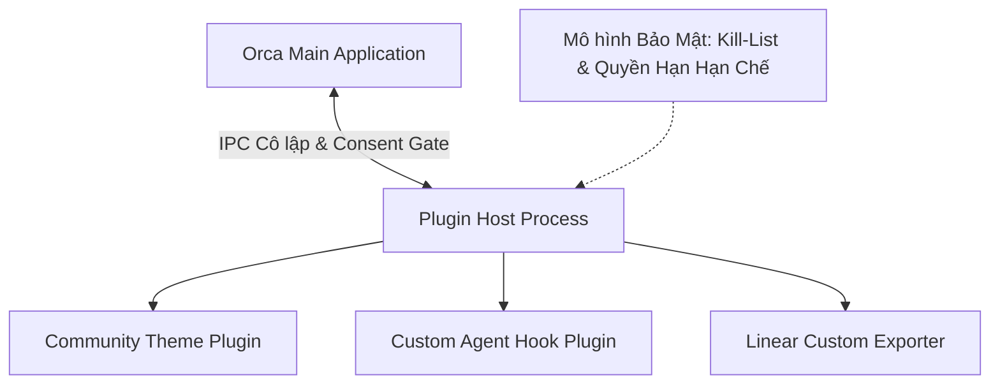
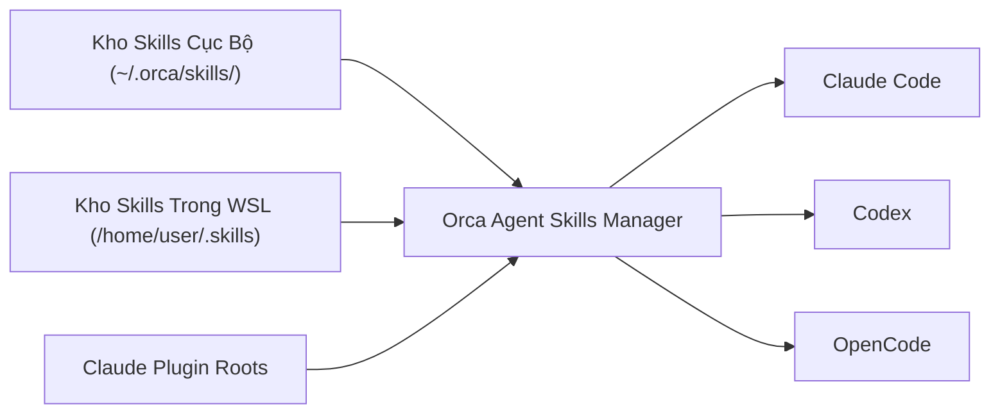

# Chương 11: Mở Rộng Hệ Thống Với Plugins & Agent Skills

> Tùy biến toàn diện Orca: Khám phá hệ thống Plugin chạy ngoài tiến trình, mô hình chia sẻ kỹ năng Agent Skills, và nhập chủ đề (theme) từ Ghostty / Warp.

  

---

## 11.1. Hệ Thống Plugin Out-Of-Process

Để đảm bảo các tiện ích mở rộng của bên thứ ba không bao giờ làm sập ứng dụng chính, Orca thiết kế kiến trúc **Plugin Host ngoài tiến trình** (`src/main/plugins/` + `plugin-host-entry.ts`):

### Các nguyên tắc an toàn cho Plugin:
1. **Mô hình Phê duyệt Quyền (Consent Model)**: Khi cài một plugin mới, Orca sẽ liệt kê chính xác các quyền mà plugin yêu cầu (quyền truy cập mạng, quyền đọc file, quyền gọi terminal) để bạn duyệt.
2. **Hệ thống Danh sách Chặn (Kill-List)**: Tự động vô hiệu hóa các plugin bị phát hiện có lỗ hổng bảo mật hoặc vi phạm chính sách an toàn.
3. **Chợ Ứng Dụng (Marketplace)**: Cho phép cài đặt, xem trước, cập nhật và quay ngược phiên bản (rollback) dễ dàng trong giao diện Settings.

---

## 11.2. Quản Lý & Chia Sẻ Kỹ Năng Agent (Agent Skills Sharing)

**Agent Skills** là các gói hướng dẫn chuyên biệt (instructions, custom scripts, schema rules) giúp nâng cao năng lực cho các AI Agent (ví dụ: skill phân tích mã nguồn React, skill tối ưu hóa SQL query, skill kiểm tra bảo mật OWASP):

- **Tự động quét & kiểm tra độ mới**: Module `src/main/skills/` tự động phát hiện các skill mới được cài trong thư mục cấu hình của Claude hoặc hệ thống, kiểm tra tính tương thích và nạp tự động cho tất cả các Agent đang chạy trong Orca.
- **Chia sẻ xuyên Agent**: Một skill viết cho Claude có thể được chuẩn hóa để dùng chung cho cả Codex, OpenCode và Gemini.

---

## 11.3. Tùy Biến Giao Diện & Nhập Theme Từ Ghostty / Warp

Orca hỗ trợ người dùng cá nhân hóa màu sắc và giao diện terminal theo phong cách yêu thích:

### 1. Nhập Theme từ Ghostty
- Đặt file cấu hình theme của Ghostty vào thư mục cấu hình của Orca.
- Bộ phân tích `src/main/ghostty/` sẽ tự động chuyển đổi bảng màu 256 màu ANSI và màu nền sang định dạng tương thích với xterm WebGL.

### 2. Nhập Theme từ Warp
- Bộ worker xử lý theme `warp-theme-parser-worker.ts` hỗ trợ đọc trực tiếp các file theme `.yaml` của Warp Terminal, giúp bạn giữ nguyên phong cách quen thuộc.

### 3. Tùy biến Token Màu Sắc (Design System Tokens)
- Toàn bộ giao diện Orca tuân theo chuẩn định nghĩa trong `src/renderer/src/assets/main.css` (Tailwind CSS v4 + Radix + Shadcn UI).
- Bạn có thể chuyển đổi linh hoạt giữa các chế độ: *Dark*, *OLED True Black*, *Nord*, *Catppuccin Mocha*, *Solarized Dark*, hoặc *Monochrome Minimalist*.

---

## 11.4. Tóm tắt chương & Bước tiếp theo

Trong chương này, bạn đã học được:
- Cơ chế vận hành plugin an toàn trong tiến trình cô lập.
- Cách chia sẻ các kỹ năng chuyên môn (Agent Skills) xuyên suốt nhiều AI Agent.
- Cách nhập và tùy biến theme từ Ghostty, Warp để có trải nghiệm thị giác tốt nhất.

👉 **Tiếp theo**: Chuyển sang [Chương 12: Chẩn Đoán & Xử Lý Sự Cố (Troubleshooting)](./12-xu-ly-su-co-troubleshooting.md) để nắm vững các phương pháp xử lý lỗi và bảo dưỡng hệ thống.
