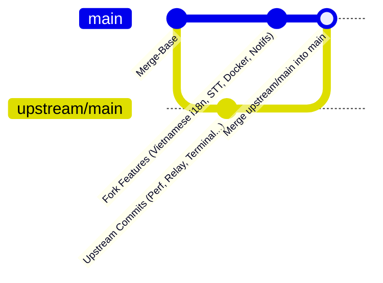

# Kế hoạch đồng bộ mã nguồn từ repo gốc (upstream) vào local và GitHub (origin)

Tài liệu này mô tả chi tiết quy trình đồng bộ cập nhật từ `upstream/main` (`stablyai/orca`) vào `main` local và đẩy lên `origin/main` (`covuaduongsinh/orca`).

## 1. Bối cảnh & Hiện trạng

- **Repo gốc (upstream)**: `https://github.com/stablyai/orca.git` (nhánh `upstream/main` có nhiều commit cải tiến mới nhất về hiệu năng, terminal, relay, localization, v.v.).
- **Repo fork (origin)**: `https://github.com/covuaduongsinh/orca.git`.
- **Nhánh local `main`**: Đang lưu giữ các tính năng tùy biến của fork bao gồm:
  - Hỗ trợ bản dịch và cài đặt mặc định tiếng Việt (`vi` locale, localization tests).
  - Tính năng nhận diện giọng nói tiếng Việt (STT / Web Speech API / Groq / Whisper).
  - Cấu hình Docker deploy VPS / Dokploy (`orca-serve-vps`, Dockerfile).
  - Thông báo khi tác vụ agent cần cấp quyền ngoài active tab (`agent-permission-needed`).
  - Sửa lỗi kiểu dữ liệu (portable types) cho test mocks.

---

## 2. Các điểm xung đột (Conflicts) & Hướng xử lý

| STT | Tệp tin | Nguyên nhân xung đột | Hướng giải quyết |
|---|---|---|---|
| 1 | `src/main/codex-accounts/runtime-home-settings-test-fixtures.ts` | Upstream chuyển sang dùng helper `createCodexAccountSettings` trong khi fork thêm settings thủ công. | Sử dụng cấu trúc helper mới của upstream và giữ lại các giá trị cấu hình tương thích. |
| 2 | `src/main/codex-accounts/service-test-harness.ts` | Thay đổi tham số / fixture khởi tạo codex account. | Đồng bộ theo API mới nhất của upstream. |
| 3 | `src/main/ipc/notifications.ts` | Upstream thêm logic `readDesktopAwayState` và mobile push metadata, fork có kênh `agent-permission-needed`. | Giữ lại kênh `agent-permission-needed` của fork đồng thời tích hợp đầy đủ cơ chế mới của upstream. |
| 4 | `src/main/runtime/runtime-mobile-notification-controller.ts` | Xung đột trường metadata gửi notification tới mobile. | Giữ các trường mới của upstream và payload tương thích của fork (`agent-permission-needed`). |
| 5 | `src/renderer/src/components/terminal-pane/agent-task-complete-policy.ts` | Upstream đơn giản hóa `isAgentTaskCompleteTrackingEnabledFromState`, fork có `isPermissionNeededOsNotificationEnabledFromState`. | Tích hợp hàm kiểm tra quyền của fork song song với policy tracking mới của upstream. |
| 6 | `src/renderer/src/components/terminal-pane/pty-connection/agent-task-complete-notify.ts` | Upstream tái cấu trúc dispatch notification. | Giữ kênh `agent-permission-needed` và tích hợp với dispatch mới. |
| 7 | `src/renderer/src/hooks/agent-hook-completion-notifications.ts` | Upstream tách code sang module `agent-hook-completion-pane-liveness.ts`. | Sử dụng import từ module mới của upstream, giữ lại routing `agent-permission-needed`. |
| 8 | `src/renderer/src/hooks/agent-hook-completion-notifications.test.ts` | Cập nhật bộ test tương ứng với logic module mới. | Cập nhật test case đảm bảo cả case completion lẫn permission-needed đều pass. |
| 9 | `src/renderer/src/i18n/locales/en.json` | Upstream thêm translation keys mới (contrast, recovery, subagents...). | Gộp các key mới từ upstream, giữ lại các key tiếng Việt/STT của fork; sau đó chạy `pnpm sync:localization-catalog` để đồng bộ sang `vi.json`, `es.json`, `ja.json`, `ko.json`, `zh.json`. |

---

## 3. Các bước triển khai chi tiết (Execution Steps)

### Bước 1: Thực hiện Git Merge
- Merge `upstream/main` vào nhánh local `main`.

### Bước 2: Giải quyết xung đột (Conflict Resolution)
- Xử lý từng tệp trong danh sách 9 tệp nêu trên.
- Đồng bộ catalog bản dịch:
  - `pnpm sync:localization-catalog`
  - `pnpm verify:localization-catalog`
  - `pnpm verify:localization-coverage`
- Hoàn tất commit merge:
  - `git add .`
  - `git commit -m "Merge upstream/main into main (preserve custom features and resolve conflicts)"`

### Bước 3: Kiểm tra và xác minh (Verification)
- Chạy Typecheck toàn bộ dự án: `pnpm tc`
- Chạy unit tests liên quan đến notifications, i18n, speech, và runtime:
  - `pnpm test src/renderer/src/hooks/agent-hook-completion-notifications.test.ts`
  - `pnpm test src/main/ipc/notifications.test.ts`
  - `pnpm test src/renderer/src/i18n/`

### Bước 4: Đồng bộ lên GitHub (Push to origin)
- `git push origin main`
