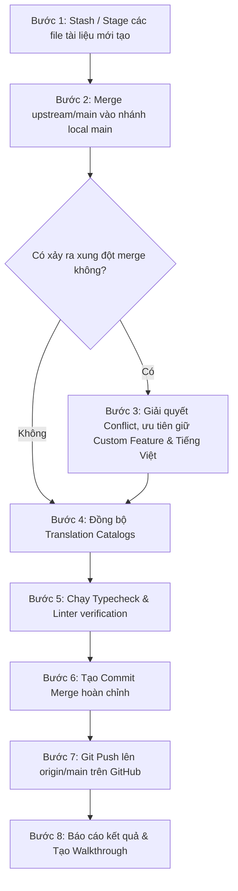

# Kế Hoạch Đồng Bộ & Cập Nhật Từ Upstream Repo (stablyai/orca)

- **Mục tiêu**: Đồng bộ 644+ commits mới nhất từ repository gốc (`upstream/main` - `stablyai/orca`) vào nhánh `main` ở môi trường local và đẩy lên GitHub cá nhân (`origin/main` - `covuaduongsinh/orca`).
- **Nguyên tắc cốt lõi**:
  - Bảo toàn 100% các tính năng tùy biến hiện có của dự án:
    1. Gói bản địa hóa tiếng Việt toàn diện (`i18n vi`).
    2. Tính năng nhận diện giọng nói tiếng Việt & Whisper Base (`speech / STT`).
    3. Cấu hình triển khai Docker/VPS (`orca-serve-vps`, Antigravity CLI, Bun, OMP).
    4. Bộ tài liệu đặc tả kiến trúc, bộ nhớ, kỹ năng (`TECH.md`, `MEMORY.md`, `SKILLS.md`, `CLAUDE.md`) và các kế hoạch trong `docs/plans/`.
  - Cập nhật và đồng bộ catalog dịch thuật (`sync:localization-catalog`, `sync:localization-runtime-catalog`) nếu upstream bổ sung các chuỗi mới.
  - Vượt qua các cổng kiểm tra an toàn (`pnpm tc`, `pnpm run check:code-quality:changed`).

---

## 1. Hiện Trạng & Phân Tích Trước Khi Đồng Bộ

- **Remotes**:
  - `origin`: `https://github.com/covuaduongsinh/orca.git` (Repo cá nhân trên GitHub)
  - `upstream`: `https://github.com/stablyai/orca.git` (Repo gốc chính thức)
- **Tình trạng nhánh**:
  - Nhánh hiện tại: `main`
  - Khoảng cách: Ahead 31 commits (chứa các tính năng custom) / Behind 644 commits (từ upstream)
- **Unstaged changes / Untracked files**:
  - Đã lưu giữ: `MEMORY.md`, `SKILLS.md`, `TECH.md`, `CLAUDE.md`, `docs/plans/*`.

---

## 2. Quy Trình Triển Khai Chi Tiết (Execution Steps)



### Bước 1: Lưu giữ an toàn các thay đổi cục bộ
- Đảm bảo các file tài liệu mới (`TECH.md`, `MEMORY.md`, `SKILLS.md`, `CLAUDE.md`, `docs/plans/*`) được lưu vết hoặc thêm vào staging (`git add`).

### Bước 2: Thực hiện Merge `upstream/main`
- Chạy lệnh merge:
  ```bash
  git merge upstream/main -m "Merge upstream/main into main (resolve conflicts, preserve custom features, sync i18n)"
  ```

### Bước 3: Rà soát & Xử lý xung đột (Conflict Resolution)
- Nếu phát sinh xung đột ở các file:
  - `src/renderer/src/assets/locales/*`: Giữ catalog tiếng Việt `vi.json` và bổ sung các keys mới từ `en.json`.
  - `package.json` hoặc build scripts: Giữ các scripts và dependencies phục vụ VPS Docker, Whisper, Antigravity.
  - `Dockerfile` / Docker configs: Giữ nguyên các cấu hình container tùy biến.

### Bước 4: Đồng bộ chuỗi ngôn ngữ và cập nhật Catalog
- Chạy các script tự động đồng bộ i18n runtime của Orca:
  ```bash
  pnpm run sync:localization-catalog
  pnpm run sync:localization-runtime-catalog
  pnpm run generate:rpc-params-catalog
  pnpm run generate:bundled-skill-guides
  pnpm run generate:skill-bundle-manifest
  ```

### Bước 5: Kiểm tra chất lượng & sửa lỗi (Quality Gates)
- Kiểm tra tính hợp lệ về kiểu dữ liệu:
  ```bash
  pnpm tc
  ```
- Kiểm tra code quality trên các file thay đổi:
  ```bash
  pnpm run check:code-quality:changed
  ```

### Bước 6: Đẩy mã nguồn lên GitHub (`origin/main`)
- Kiểm tra lại lịch sử commit và đẩy lên repo cá nhân:
  ```bash
  git push origin main
  ```

---

## 3. Kế Hoạch Xác Minh (Verification Plan)

### Kiểm thử tự động (Automated Tests)
- `pnpm tc`: Xác nhận không có lỗi TypeScript phát sinh từ các thay đổi của upstream.
- `pnpm run check:code-quality:changed`: Đảm bảo quy chuẩn code tuân thủ linting và design system.
- `pnpm test`: Chạy unit tests cho các module cốt lõi.

### Kiểm tra thủ công (Manual Verification)
- Xác nhận trên GitHub (`covuaduongsinh/orca`) đã cập nhật đầy đủ commit mới nhất.
- Xác nhận các tính năng tiếng Việt, Whisper và Docker config vẫn hoạt động nguyên vẹn.
