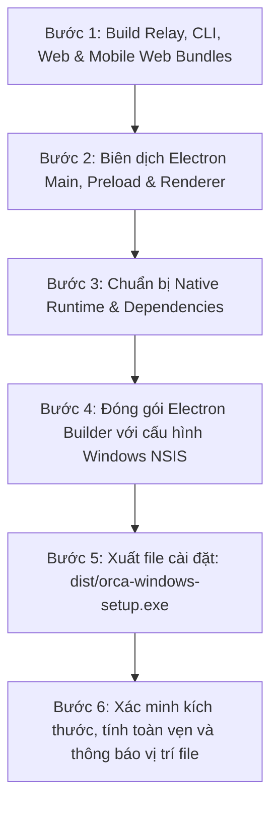

# Kế Hoạch Tạo Bản Cài Đặt Desktop (Windows Installer) Để Cập Nhật Phần Mềm

- **Mục tiêu**: Biên dịch, đóng gói và tạo ra file cài đặt desktop cho Windows (`.exe` NSIS installer) chứa toàn bộ các bản cập nhật mới nhất (644 commits upstream, bản dịch tiếng Việt, Speech/Whisper, các bản vá bảo mật và tài liệu).
- **Thư mục lưu kế hoạch**: [`docs/plans/`](file:///d:/code/orca/docs/plans)
- **Đầu ra mong muốn**: File cài đặt `dist/orca-windows-setup.exe` để người dùng có thể chạy trực tiếp và cập nhật phần mềm Orca trên máy tính.

---

## 1. Phân Tích Quy Trình Đóng Gói (Build & Packaging Pipeline)



### Các bước kỹ thuật chi tiết:

1. **`build:relay`**: Đóng gói Relay WebSocket server cho module kết nối từ xa.
2. **`build:cli`**: Biên dịch Orca CLI binary trong `out/cli/`.
3. **`build:electron-vite`**: Biên dịch React 19 UI (Renderer), Preload scripts và Electron Main Process.
4. **`build:mobile-web`**: Đóng gói giao diện mobile-web companion.
5. **`ensure:electron-runtime`**: Xác thực và liên kết các native bindings (`node-pty`, `conpty`, `windows-registry`) tương thích với Electron 43.7.5.
6. **`electron-builder --win`**: Sử dụng NSIS để đóng gói toàn bộ vào một file setup tự động: `dist/orca-windows-setup.exe`.

---

## 2. Các Hạng Mục Kiểm Tra & An Toàn (Safety & Verification)

> [!IMPORTANT]
> - **Cấu hình Uninstaller an toàn**: Installer NSIS được tích hợp hook tự động dọn dẹp daemon cũ mà không làm gián đoạn các terminal đang mở của phiên làm việc trước.
> - **Tương thích Windows 10/11 x64**: Hỗ trợ đầy đủ ConPTY và Windows Registry native addon.

---

## 3. Lệnh Thực Thi (Command Execution)

```bash
# Thực hiện toàn bộ quy trình build và đóng gói Windows Installer:
pnpm run build:win
```

*File sau khi đóng gói sẽ nằm tại:*
📁 `D:\code\orca\dist\orca-windows-setup.exe`
(Kèm thư mục portable chạy trực tiếp không cần cài: `D:\code\orca\dist\win-unpacked\Orca.exe`)
