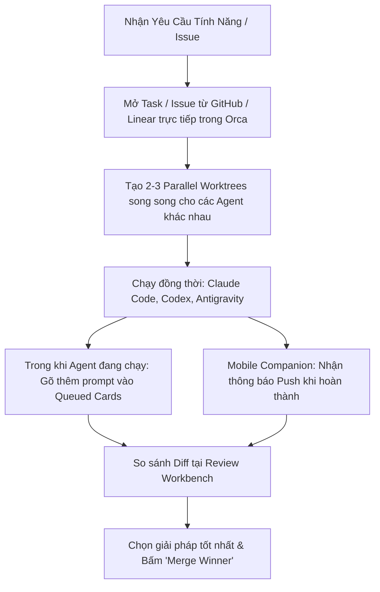

# Kế Hoạch & Bản Đặc Tả Tính Năng Mới và Best Practices Của Orca

- **Mục tiêu**: Liệt kê chi tiết toàn bộ các tính năng mới vừa được đồng bộ từ bản cập nhật 644 commits của upstream, hướng dẫn chi tiết cách sử dụng từng tính năng trong quy trình phát triển thực tế, và tổng hợp các **Best Practices** giúp lập trình viên tối ưu hóa 100x năng suất khi làm việc cùng nhiều AI Agents.
- **Thư mục lưu trữ**: [`docs/plans/`](file:///d:/code/orca/docs/plans)

---

## 1. Danh Mục Các Tính Năng Mới Đột Phá Vừa Được Tích Hợp

### 1.1. Native Chat & Thẻ Tin Nhắn Chờ (Mid-Turn Queued Message Cards)
- **Mô tả**: Khi Agent (Claude Code, Codex, Antigravity, OpenCode...) đang trong quá trình thực thi một tác vụ dài, bạn không cần phải đợi Agent làm xong mới được gõ tiếp. Mọi tin nhắn hoặc yêu cầu chỉnh hướng bạn nhập vào sẽ xuất hiện dưới dạng **Thẻ chờ có thể chỉnh sửa (Editable Cards)** ngay trên khung soạn thảo (Composer).
- **Lợi ích**: Tiết kiệm 100% thời gian chờ đợi; bạn có thể bổ sung yêu cầu, sửa lại prompt trước khi Agent bắt đầu lượt tiếp theo.

### 1.2. Phân Vùng Độc Lập Cho Subagents (Subagent Roster & Conversation Isolation)
- **Mô tả**: Khi Agent chính triệu gọi các Subagents (như `researcher`, `bug-hunter`, `tester`), luồng tin nhắn và nhật ký thực thi của Subagent sẽ được phân chia vào các mục riêng biệt (Subagent Section) thay vì trộn lẫn làm tràn ngập màn hình chat chính.
- **Lợi ích**: Giữ cho ngữ cảnh hội thoại chính luôn trong sáng, dễ theo dõi, không bị nhiễu bởi hàng trăm dòng log tra cứu.

### 1.3. Cơ Sở Dữ Liệu Nhật Ký Phiên Có Cấu Trúc (Structured Session Journaling)
- **Mô tả**: Mỗi máy chủ thực thi (Execution Host) sở hữu một cơ sở dữ liệu SQLite Journal chuyên biệt ghi lại chi tiết từng khung giao tiếp (Translation Frames), công cụ đã gọi, mã đã sửa và trạng thái phiên làm việc.
- **Lợi ích**: Phiên làm việc không bao giờ bị mất khi khởi động lại ứng dụng; hỗ trợ tính năng tua lại (`/rewind`), tiếp tục phiên (`resume`) mượt mà giữa TUI và GUI.

### 1.4. Tự Động Tin Cậy Thư Mục Worktree (Auto Pre-Trust Worktree Isolation)
- **Mô tả**: Orca tự động cấp quyền tin cậy (Pre-trust) cho đúng thư mục Git Worktree mà Agent được khởi chạy, không cần phải duyệt thủ công từng lời nhắc xác nhận bảo mật lặp lại.
- **Lợi ích**: Tăng tốc độ tự động hóa tối đa cho các quy trình song song đa tác vụ.

### 1.5. Cải Tiến Đột Phá Trên Mobile Companion App
- **Mô tả**: Đồng bộ tính năng thẻ tin nhắn chờ lên ứng dụng di động; tối ưu hóa cổng Push Gateway (12 delivery drains + 6 kết nối cơ sở dữ liệu độc lập).
- **Lợi ích**: Nhận thông báo hoàn thành tức thì (< 1 giây) trên điện thoại và chỉ đạo Agent từ bất cứ đâu.

---

## 2. Hướng Dẫn Sử Dụng Các Tính Năng Cốt Lõi Trong Thực Tế

1. **Khởi chạy nhiều Agent trên cùng 1 bài toán (Fan-out Workflow)**:
   - Nhấn `Cmd/Ctrl + Shift + W` để mở nhanh một nhánh Worktree mới.
   - Chạy `Codex` ở Worktree A và `Claude Code` ở Worktree B cùng một prompt.
2. **Sử dụng Design Mode để lấy chuẩn xác CSS & Screenshot**:
   - Mở tab Browser tích hợp (`Ctrl + Shift + B`), trỏ tới trang web dev (`localhost:3000`).
   - Bật chế độ Design Mode, click vào nút hoặc khung cần chỉnh sửa.
   - Nhấn gửi: Orca tự động nhúng toàn bộ HTML, CSS Styles và ảnh chụp màn hình crop vào terminal của Agent.
3. **Kích hoạt tính năng đọc chính tả giọng nói Tiếng Việt (Whisper STT)**:
   - Bật micro trên thanh công cụ hoặc phím tắt `Ctrl + Space` để nói tiếng Việt trực tiếp, hệ thống tự động chuyển thành prompt chuẩn xác.

---

## 3. Các Best Practices Giúp Tăng Năng Suất 100x (100x Builder Guidelines)

### 3.1. Luôn Phân Lập Tác Vụ Bằng Git Worktree
- **Không bao giờ chạy nhiều Agent trên cùng một thư mục gốc**. Hãy để Orca tự động tạo worktree cô lập cho mỗi tác vụ. Điều này loại bỏ hoàn toàn xung đột file và hỏng trạng thái Git.

### 3.2. Áp Dụng Chiến Thuật "Merge Winner" (Chọn Giải Pháp Thắng Cuộc)
- Với những bài toán thuật toán khó hoặc tái cấu trúc lớn, hãy giao cho 3 agent với 3 góc tiếp cận khác nhau (vd: agent 1 tối ưu performance, agent 2 đơn giản hóa cấu trúc, agent 3 bổ sung test coverage đầy đủ). Sau khi hoàn thành, dùng Review Workbench của Orca để so sánh diff và chỉ merge nhánh tốt nhất.

### 3.3. Tận Dụng Mid-turn Queued Cards Thay Vì Chờ Đợi
- Khi phát hiện mình quên nhắc Agent một yêu cầu kỹ thuật (vd: "nhớ thêm unit test cho case rỗng nhé"), hãy gõ ngay vào composer. Thẻ chờ sẽ giữ lệnh và tự động nạp vào ngay khi Agent xong bước hiện tại.

### 3.4. Quản Lý Biến Môi Trường Riêng Cho Từng Worktree (`.env` Isolation)
- Tận dụng skill [`orca-per-workspace-env`](file:///d:/code/orca/skills/orca-per-workspace-env/SKILL.md) để gán port khác nhau (vd: worktree 1 chạy cổng 3001, worktree 2 chạy cổng 3002), giúp bạn có thể chạy đồng thời 3 phiên bản webapp trên máy mà không bị lỗi `EADDRINUSE`.
