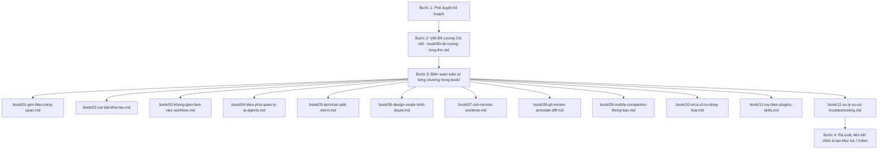

# Kế hoạch Viết Đề Cương & Bộ Sổ Tay Hướng Dẫn Sử Dụng Phần Mềm Orca

## 1. Mục tiêu & Bối cảnh
Xây dựng một bộ **Sổ tay Hướng dẫn Sử dụng Toàn diện (User Handbook & Guidebook)** cho phần mềm **Orca** (The AI Orchestrator for 100x builders) bằng tiếng Việt chuẩn kỹ thuật, trực quan, thực tế và dễ tiếp cận cho cả người mới bắt đầu lẫn lập trình viên chuyên nghiệp.

Tài liệu được chia nhỏ theo từng chương độc lập đặt trong thư mục `book/`, có cấu trúc chặt chẽ dựa trên đề cương tổng thể chuẩn hóa, phản ánh chính xác các tính năng thực tế của Orca (Worktrees song song, 39+ AI Agents, Terminal WebGL Ghostty-class, Design Mode, SSH Remote, Mobile Companion, Annotate AI Diffs, v.v.).

---

## 2. Quy trình Thực hiện (Execution Workflow)

---

## 3. Dự thảo Cấu trúc Đề cương & Các Chương (`book/`)

Mỗi chương sẽ là một file Markdown riêng biệt trong thư mục `book/`:

| Thứ tự | Tên File | Nội dung trọng tâm |
| :--- | :--- | :--- |
| **00** | `book/00-de-cuong-tong-the.md` | Đề cương chi tiết, mục lục tổng quan, quy ước ký hiệu, lộ trình đọc sách |
| **Chương 01** | `book/01-gioi-thieu-tong-quan.md` | Khái niệm Orca, triết lý "Process-per-risk", so sánh với VS Code/Cursor thông thường |
| **Chương 02** | `book/02-cai-dat-khoi-tao.md` | Hướng dẫn cài đặt trên macOS, Windows, Linux, cấu hình môi trường Node/pnpm/C++ toolchain |
| **Chương 03** | `book/03-khong-gian-lam-viec-worktree.md` | Cơ chế Git Worktree độc lập và Folder Workspace, cách tổ chức dự án, quản lý tài nguyên |
| **Chương 04** | `book/04-dieu-phoi-quan-ly-ai-agents.md` | Hỗ trợ 39+ Agent (Claude Code, Codex, Opencode, Gemini...), cơ chế Agent-hooks, Native Chat, AI Vault, quản lý tài khoản & hạn mức (Usage/Quota) |
| **Chương 05** | `book/05-terminal-split-xterm.md` | Terminal Ghostty-class WebGL, split layout vô hạn, cơ chế PTY daemon giữ scrollback và tiến trình khi đóng app |
| **Chương 06** | `book/06-design-mode-trinh-duyet.md` | Trình duyệt Chromium tích hợp, tính năng Design Mode ("Grab" DOM/CSS/ảnh vào prompt), Computer Use |
| **Chương 07** | `book/07-ssh-remote-worktree.md` | Làm việc với máy chủ từ xa / WSL, SSH auto-reconnect, Remote Wire protocol, Port forwarding |
| **Chương 08** | `book/08-git-review-annotate-diff.md` | Review thay đổi của AI, Annotate AI Diffs (bình luận dòng diff để agent sửa), tích hợp GitHub/GitLab/Linear/Jira |
| **Chương 09** | `book/09-mobile-companion-thong-bao.md` | Ứng dụng di động Orca Mobile (iOS/Android), kết nối mã hóa qua mã QR, điều khiển agent từ xa |
| **Chương 10** | `book/10-orca-cli-tu-dong-hoa.md` | Sử dụng CLI `orca`, các lệnh thao tác worktree, snapshot, click/fill, automation scripts |
| **Chương 11** | `book/11-tuy-bien-plugins-skills.md` | Cài đặt Plugin, Marketplace, chia sẻ Agent Skills, phím tắt & giao diện |
| **Chương 12** | `book/12-xu-ly-su-co-troubleshooting.md` | Xử lý lỗi thường gặp (EPERM Windows, SSH key, Git version baseline, crash recovery) |

---

## 4. Tiêu chuẩn & Quy cách Biên soạn
1. **Ngôn ngữ**: Tiếng Việt chuẩn kỹ thuật, thuật ngữ giữ nguyên dạng chuẩn (Worktree, Hook, PTY, Prompt, Daemon, Diff, v.v.) kèm giải thích rõ ràng.
2. **Minh họa & Trực quan**: Có sơ đồ Mermaid cho các luồng xử lý phức tạp, bảng tổng hợp phím tắt đa nền tảng (`⌘` trên macOS, `Ctrl+` trên Windows/Linux).
3. **Thực tiễn & Thực chiến**: Cung cấp các Use-Case thực tế (ví dụ: chạy cùng lúc 3 agent giải 1 bug phức tạp, so sánh và merge kết quả).
4. **Cấu trúc nhất quán**: Mỗi file chương đều có:
   - Mục tiêu học tập / Nắm bắt chương.
   - Nội dung chi tiết từng tiểu mục.
   - Hướng dẫn thực hành từng bước (Step-by-step).
   - Lưu ý quan trọng & Mẹo sử dụng (Tips & Best Practices).
   - Tóm tắt và bài tập thực hành/kiểm tra nhanh.
